# Cannabis Dispensary POS System - Technical Architecture Document

## Introduction

This document outlines the complete technical architecture for CannaPOS Thailand, including database schema, application architecture, API design, security model, and performance strategy. It serves as the definitive technical guide for development, ensuring consistency across the 12-week implementation timeline.

### Starter Template or Existing Project

**Status**: Greenfield project - No starter template

**Approach**: Custom React + Vite + Supabase architecture optimized for cannabis retail workflows. While we could use T3 Stack or similar, the specialized requirements (FIFO allocation, tiered pricing, shift reconciliation) justify a purpose-built architecture.

### Change Log

| Date       | Version | Description                                    | Author  |
| ---------- | ------- | ---------------------------------------------- | ------- |
| 2025-01-10 | 1.0     | Initial architecture from PRD v1.0 + UX Spec v1.0 | Winston |

---

## High Level Architecture

### Technical Summary

CannaPOS Thailand is a **client-side SPA + managed backend** architecture leveraging Vercel (frontend hosting) and Supabase (managed PostgreSQL + Auth + Storage + Real-time). The React 18+ frontend communicates with Supabase via auto-generated REST/GraphQL APIs, with Row-Level Security (RLS) policies enforcing authorization at the database layer. This architecture eliminates custom backend code, accelerating the 12-week timeline while maintaining enterprise-grade security and scalability. Real-time subscriptions enable live cart updates and shift dashboards, critical for multi-user POS environments. The system prioritizes tablet-optimized touch interfaces for sub-90-second transaction times, with aggressive code splitting and caching to meet <3s page load targets on 4G networks.

### Platform and Infrastructure Choice

**Platform**: Vercel (Frontend) + Supabase (Backend)

**Rationale**:
- **Rapid Development**: Supabase eliminates need for custom API layer, auth system, and database management
- **Auto-Scaling**: Both platforms scale automatically without infrastructure management
- **Cost-Effective**: Free tiers support MVP + pilot, predictable pricing for scale
- **Developer Experience**: Excellent DX with instant deploys (Vercel) and auto-generated TypeScript clients (Supabase)
- **Real-Time Built-In**: Supabase real-time subscriptions critical for POS cart updates and shift dashboards
- **RLS Security**: Database-level authorization prevents data leaks without custom middleware

**Key Services**:
- **Vercel**: Frontend hosting, edge CDN, preview deployments, GitHub integration
- **Supabase**:
  - PostgreSQL 15+ (managed database with extensions)
  - Auth (email/password, JWT tokens, RLS integration)
  - Storage (product images - future enhancement)
  - Real-time (WebSocket subscriptions for live updates)
  - Edge Functions (if needed for complex server-side logic)

**Deployment Host and Regions**:
- **Vercel**: Global edge network with Asia-Pacific optimization (Singapore, Tokyo)
- **Supabase**: Southeast Asia region (Singapore) for minimal latency to Thailand

### Repository Structure

**Structure**: Monorepo

**Rationale**:
- Share TypeScript types between frontend and database schemas
- Atomic commits across database migrations and UI changes
- Simplified CI/CD with single repository
- Easier for AI agents to maintain context

**Monorepo Tool**: pnpm workspaces (lightweight, fast, built-in to pnpm)

**Package Organization**:
```
/
├── apps/
│   └── web/              # React SPA (only app for MVP)
├── packages/
│   └── shared-types/     # Shared TypeScript interfaces
├── supabase/            # Database migrations, RLS policies, Edge Functions
└── package.json         # Root workspace config
```

### High Level Architecture Diagram

```mermaid
graph TD
    User[👤 Cashier/Manager<br/>iPad / Desktop] -->|HTTPS| Vercel[Vercel Edge CDN<br/>React SPA]

    Vercel -->|REST/GraphQL API<br/>via Supabase Client| SupabaseAPI[Supabase API Gateway]

    SupabaseAPI -->|Auth Tokens| SupabaseAuth[Supabase Auth<br/>JWT + RLS]
    SupabaseAPI -->|Query/Mutation| SupabaseDB[(Supabase PostgreSQL<br/>RLS Policies)]
    SupabaseAPI -->|Subscribe| SupabaseRealtime[Supabase Real-time<br/>WebSocket]

    SupabaseDB -->|Change Events| SupabaseRealtime
    SupabaseRealtime -->|Live Updates| Vercel

    Vercel -->|Future: Images| SupabaseStorage[Supabase Storage<br/>Product Images]

    GitHub[GitHub Repository] -->|Push to main| GHA[GitHub Actions<br/>CI/CD]
    GHA -->|Deploy Frontend| Vercel
    GHA -->|Run Migrations| SupabaseDB

    style User fill:#e1f5ff
    style Vercel fill:#ffe1e1
    style SupabaseDB fill:#e1ffe1
    style SupabaseAuth fill:#fff9e1
```



### Architectural Patterns

- **Jamstack Architecture**: Static SPA served from CDN + serverless backend (Supabase) - *Rationale:* Optimal performance, global scalability, minimal operational overhead

- **Component-Based UI**: React functional components with TypeScript - *Rationale:* Reusability, type safety, excellent tooling ecosystem

- **Database-Centric Authorization**: Row-Level Security (RLS) policies in PostgreSQL - *Rationale:* Security enforced at data layer, impossible to bypass via API

- **Optimistic UI Updates**: Client-side state updates before server confirmation - *Rationale:* Perceived performance for <100ms interaction response

- **FIFO Allocation Pattern**: Batch inventory allocated from oldest received_date first - *Rationale:* Product freshness, accurate COGS calculation

- **State Machine Pattern**: Shift lifecycle (Open → Pending Approval → Approved/Rejected) - *Rationale:* Clear state transitions, prevents invalid operations

- **Repository Pattern**: Abstract Supabase queries behind service layer - *Rationale:* Testability, future database migration flexibility

---

## Tech Stack

| Category                  | Technology                         | Version | Purpose                                      | Rationale                                                                 |
| ------------------------- | ---------------------------------- | ------- | -------------------------------------------- | ------------------------------------------------------------------------- |
| **Frontend Language**     | TypeScript                         | 5.3+    | Type-safe JavaScript                         | Catch errors at compile time, excellent IDE support, mandatory for scale |
| **Frontend Framework**    | React                              | 18.2+   | UI library                                   | Industry standard, huge ecosystem, concurrent features for performance   |
| **UI Component Library**  | shadcn/ui                          | Latest  | Accessible component primitives              | Copy-paste approach (full control), Radix UI accessibility, Tailwind CSS |
| **State Management**      | Zustand + React Context            | 4.5+    | Client state (cart, UI), global state (auth) | Minimal boilerplate, excellent DX, <1KB bundle for cart state            |
| **Routing**               | React Router                       | 6.21+   | Client-side routing                          | Industry standard for SPAs, nested routes, data loading                  |
| **Build Tool**            | Vite                               | 5.0+    | Dev server and bundler                       | Fast HMR, excellent DX, optimal production builds                        |
| **CSS Framework**         | Tailwind CSS                       | 3.4+    | Utility-first CSS                            | Rapid styling, consistent design system, purges unused CSS               |
| **Form Handling**         | React Hook Form + Zod              | 7.49+   | Form state + validation                      | Performant, minimal re-renders, type-safe validation schemas             |
| **Database**              | Supabase (PostgreSQL)              | 15+     | Managed PostgreSQL with RLS                  | Auto-scaling, RLS for security, real-time, auth integration              |
| **Backend API**           | Supabase Auto-Generated REST/GQL   | N/A     | Database API layer                           | No custom API code, auto-typed, instant updates on schema changes        |
| **Authentication**        | Supabase Auth                      | Latest  | Email/password auth + JWT                    | Integrated with RLS, battle-tested, minimal setup                        |
| **Real-Time**             | Supabase Real-time                 | Latest  | WebSocket subscriptions                      | Live cart updates, shift dashboards, built-in to Supabase                |
| **File Storage**          | Supabase Storage                   | Latest  | Product images (future)                      | S3-compatible, RLS policies, CDN integration                             |
| **Frontend Testing**      | Vitest + React Testing Library     | 1.2+    | Unit + component tests                       | Fast, Vite-native, same API as Jest, RTL for React best practices       |
| **Backend Testing**       | Supabase Test Helpers + pg-tap     | Latest  | Database tests (RLS, functions)              | Test RLS policies, triggers, Edge Functions                              |
| **E2E Testing**           | Manual UAT (Epic 7)                | N/A     | End-to-end user testing                      | Sufficient for MVP, manual testing by pilot users cheaper than Playwright|
| **Type Generation**       | Supabase CLI                       | Latest  | Generate TS types from database schema       | Auto-sync types, prevents schema-code drift                              |
| **Package Manager**       | pnpm                               | 8.15+   | Fast, disk-efficient package manager         | 2-3x faster than npm, strict dep resolution, workspace support           |
| **Linting**               | ESLint + TypeScript ESLint         | 8.56+   | Code quality and consistency                 | Industry standard, catches bugs, enforces style                          |
| **Formatting**            | Prettier                           | 3.2+    | Opinionated code formatter                   | Zero config, consistent style, integrates with ESLint                    |
| **CI/CD**                 | GitHub Actions                     | Latest  | Automated testing + deployment               | Free for public repos, native GitHub integration                         |
| **Hosting (Frontend)**    | Vercel                             | Latest  | Edge CDN for React SPA                       | Zero-config deploys, preview envs, global edge, generous free tier       |
| **Hosting (Backend)**     | Supabase Cloud                     | Latest  | Managed PostgreSQL + services                | Auto-scaling, backups, monitoring, free tier sufficient for MVP          |
| **Monitoring (Frontend)** | Vercel Analytics + Web Vitals      | Latest  | Performance monitoring                       | Built-in, free, Core Web Vitals tracking                                 |
| **Monitoring (Backend)**  | Supabase Dashboard                 | Latest  | Database performance, query logs             | Built-in, query performance insights, connection pooling metrics         |
| **Error Tracking**        | Sentry (optional, Epic 7)          | Latest  | Client + server error tracking               | Industry standard, source maps, release tracking                         |
| **Date Handling**         | date-fns                           | 3.2+    | Lightweight date utilities                   | Modular, tree-shakable, no Moment.js bloat                               |
| **Chart Library**         | Recharts                           | 2.10+   | React chart components                       | Composable, responsive, sufficient for MVP reports                       |

---

## Data Models

### User

**Purpose**: Represents authenticated users (cashiers, managers, owners) with role-based access.

**Key Attributes**:
- `id`: UUID (primary key, from Supabase Auth)
- `email`: string (unique, from Supabase Auth)
- `name`: string (display name)
- `role`: enum ('cashier', 'manager', 'owner')
- `location_id`: UUID (FK to locations, nullable for owners with multi-location access)
- `created_at`: timestamp
- `updated_at`: timestamp

**TypeScript Interface**:
```typescript
export interface User {
  id: string; // UUID
  email: string;
  name: string;
  role: 'cashier' | 'manager' | 'owner';
  location_id: string | null;
  created_at: string; // ISO 8601
  updated_at: string;
}
```

**Relationships**:
- `users.location_id` → `locations.id` (many-to-one, nullable)
- `users.id` ← `transactions.user_id` (one-to-many)
- `users.id` ← `shifts.opened_by_user_id` (one-to-many)

---

### Location

**Purpose**: Represents physical dispensary locations for multi-location support.

**Key Attributes**:
- `id`: UUID (primary key)
- `name`: string (e.g., "Pilot Location - Bangkok")
- `address`: string (optional for MVP)
- `created_at`: timestamp
- `updated_at`: timestamp

**TypeScript Interface**:
```typescript
export interface Location {
  id: string;
  name: string;
  address: string | null;
  created_at: string;
  updated_at: string;
}
```

**Relationships**:
- `locations.id` ← `users.location_id` (one-to-many)
- `locations.id` ← `products.location_id` (one-to-many, if multi-location inventory)
- `locations.id` ← `shifts.location_id` (one-to-many)

---

### Product

**Purpose**: Core product catalog (flower, pre-rolls, edibles, etc.)

**Key Attributes**:
- `id`: UUID (primary key)
- `sku`: string (unique, auto-generated or manual)
- `name`: string (product name)
- `category`: enum ('Flower', 'Pre-Roll', 'Edible', 'Concentrate', 'Other')
- `unit`: enum ('gram', 'piece', 'bottle', 'package')
- `base_price`: decimal (default price, overridden by tier pricing for flowers)
- `requires_tare_weight`: boolean (true for flower products)
- `reorder_threshold`: decimal (low stock alert level, defaults 50g for flower, 10 for others)
- `is_active`: boolean (soft delete flag)
- `location_id`: UUID (FK to locations, nullable for global products)
- `created_at`: timestamp
- `updated_at`: timestamp

**TypeScript Interface**:
```typescript
export type ProductCategory = 'Flower' | 'Pre-Roll' | 'Edible' | 'Concentrate' | 'Other';
export type ProductUnit = 'gram' | 'piece' | 'bottle' | 'package';

export interface Product {
  id: string;
  sku: string;
  name: string;
  category: ProductCategory;
  unit: ProductUnit;
  base_price: number; // Decimal as number (in satangs/cents if needed)
  requires_tare_weight: boolean;
  reorder_threshold: number;
  is_active: boolean;
  location_id: string | null;
  created_at: string;
  updated_at: string;
}
```

**Relationships**:
- `products.location_id` → `locations.id` (many-to-one, nullable)
- `products.id` ← `product_batches.product_id` (one-to-many)
- `products.id` ← `transaction_items.product_id` (one-to-many)

---

### ProductBatch

**Purpose**: Tracks individual inventory batches with FIFO allocation, cost basis, and expiration.

**Key Attributes**:
- `id`: UUID (primary key)
- `product_id`: UUID (FK to products)
- `batch_number`: string (auto-generated: `{SKU}-{YYYYMMDD}-{SEQ}`)
- `quantity_received`: decimal (original quantity)
- `quantity_remaining`: decimal (current quantity, decremented via FIFO)
- `cost_per_unit`: decimal (purchase cost for COGS calculation)
- `received_date`: date (for FIFO ordering)
- `expiration_date`: date (nullable, for batch expiration tracking)
- `status`: enum ('Active', 'Depleted')
- `depleted_at`: timestamp (nullable, set when quantity_remaining = 0)
- `created_at`: timestamp
- `updated_at`: timestamp

**TypeScript Interface**:
```typescript
export type BatchStatus = 'Active' | 'Depleted';

export interface ProductBatch {
  id: string;
  product_id: string;
  batch_number: string;
  quantity_received: number;
  quantity_remaining: number;
  cost_per_unit: number;
  received_date: string; // ISO 8601 date
  expiration_date: string | null;
  status: BatchStatus;
  depleted_at: string | null;
  created_at: string;
  updated_at: string;
}
```

**Relationships**:
- `product_batches.product_id` → `products.id` (many-to-one)
- `product_batches.id` ← `batch_allocations` in `transaction_items.batch_allocations` JSONB (one-to-many, embedded)

---

### PricingTier

**Purpose**: Defines tiered pricing rules for flower products based on total weight.

**Key Attributes**:
- `id`: UUID (primary key)
- `tier_name`: string (e.g., "Tier 2: 3-6.99g")
- `min_weight_grams`: decimal (inclusive minimum)
- `max_weight_grams`: decimal (inclusive maximum, NULL for highest tier)
- `price_per_gram`: decimal (฿ per gram for this tier)
- `location_id`: UUID (FK to locations, nullable for global tiers)
- `created_at`: timestamp
- `updated_at`: timestamp

**TypeScript Interface**:
```typescript
export interface PricingTier {
  id: string;
  tier_name: string;
  min_weight_grams: number;
  max_weight_grams: number | null; // NULL for highest tier (e.g., "28g+")
  price_per_gram: number;
  location_id: string | null;
  created_at: string;
  updated_at: string;
}
```

**Relationships**:
- `pricing_tiers.location_id` → `locations.id` (many-to-one, nullable)
- `pricing_tiers.id` ← `transaction_items.tier_id` (one-to-many, for audit trail)

---

### Shift

**Purpose**: Tracks shift-to-shift reconciliation with mandatory cash counting.

**Key Attributes**:
- `id`: UUID (primary key)
- `shift_definition_id`: UUID (FK to shift_definitions for AM/PM schedule)
- `location_id`: UUID (FK to locations)
- `opened_by_user_id`: UUID (FK to users, cashier who opened)
- `closed_by_user_id`: UUID (FK to users, nullable until closed)
- `approved_by_user_id`: UUID (FK to users, nullable until approved)
- `opened_at`: timestamp
- `closed_at`: timestamp (nullable until closed)
- `approved_at`: timestamp (nullable until approved)
- `starting_cash_float`: decimal (cash at shift open)
- `actual_cash_count`: decimal (nullable, entered at close)
- `variance`: decimal (nullable, calculated: actual - expected)
- `variance_reason`: text (nullable, required if |variance| > ฿50)
- `handoff_notes`: text (nullable, notes for next shift)
- `status`: enum ('Open', 'Pending Approval', 'Approved', 'Rejected', 'Force Closed')
- `force_closed`: boolean (default false, true if manager force-closed)
- `rejection_reason`: text (nullable, if status = Rejected)
- `created_at`: timestamp
- `updated_at`: timestamp

**TypeScript Interface**:
```typescript
export type ShiftStatus = 'Open' | 'Pending Approval' | 'Approved' | 'Rejected' | 'Force Closed';

export interface Shift {
  id: string;
  shift_definition_id: string;
  location_id: string;
  opened_by_user_id: string;
  closed_by_user_id: string | null;
  approved_by_user_id: string | null;
  opened_at: string;
  closed_at: string | null;
  approved_at: string | null;
  starting_cash_float: number;
  actual_cash_count: number | null;
  variance: number | null;
  variance_reason: string | null;
  handoff_notes: string | null;
  status: ShiftStatus;
  force_closed: boolean;
  rejection_reason: string | null;
  created_at: string;
  updated_at: string;
}
```

**Relationships**:
- `shifts.shift_definition_id` → `shift_definitions.id` (many-to-one)
- `shifts.location_id` → `locations.id` (many-to-one)
- `shifts.opened_by_user_id` → `users.id` (many-to-one)
- `shifts.id` ← `transactions.shift_id` (one-to-many)

---

### ShiftDefinition

**Purpose**: Defines shift schedules (AM/PM) per location.

**Key Attributes**:
- `id`: UUID (primary key)
- `location_id`: UUID (FK to locations)
- `shift_name`: enum ('AM', 'PM')
- `start_time`: time (e.g., "12:00:00")
- `end_time`: time (e.g., "18:00:00")
- `created_at`: timestamp
- `updated_at`: timestamp

**TypeScript Interface**:
```typescript
export type ShiftName = 'AM' | 'PM';

export interface ShiftDefinition {
  id: string;
  location_id: string;
  shift_name: ShiftName;
  start_time: string; // HH:mm:ss
  end_time: string;
  created_at: string;
  updated_at: string;
}
```

**Relationships**:
- `shift_definitions.location_id` → `locations.id` (many-to-one)
- `shift_definitions.id` ← `shifts.shift_definition_id` (one-to-many)

---

### Transaction

**Purpose**: Records completed sales transactions.

**Key Attributes**:
- `id`: UUID (primary key)
- `user_id`: UUID (FK to users, cashier)
- `location_id`: UUID (FK to locations)
- `shift_id`: UUID (FK to shifts)
- `total_amount`: decimal (final total in ฿)
- `payment_method`: enum ('Cash', 'Card', 'QR Code') - default 'Cash' for MVP
- `transaction_date`: timestamp (when transaction completed)
- `created_at`: timestamp
- `updated_at`: timestamp

**TypeScript Interface**:
```typescript
export type PaymentMethod = 'Cash' | 'Card' | 'QR Code';

export interface Transaction {
  id: string;
  user_id: string;
  location_id: string;
  shift_id: string;
  total_amount: number;
  payment_method: PaymentMethod;
  transaction_date: string;
  created_at: string;
  updated_at: string;
}
```

**Relationships**:
- `transactions.user_id` → `users.id` (many-to-one)
- `transactions.location_id` → `locations.id` (many-to-one)
- `transactions.shift_id` → `shifts.id` (many-to-one)
- `transactions.id` ← `transaction_items.transaction_id` (one-to-many)

---

### TransactionItem

**Purpose**: Line items for each transaction with FIFO batch allocation, tier pricing, and tare weights.

**Key Attributes**:
- `id`: UUID (primary key)
- `transaction_id`: UUID (FK to transactions)
- `product_id`: UUID (FK to products)
- `quantity`: decimal (net quantity after tare deduction)
- `unit_price`: decimal (price per unit, tier price for flowers)
- `line_total`: decimal (quantity × unit_price)
- `tier_id`: UUID (FK to pricing_tiers, nullable, only for flower products)
- `gross_weight`: decimal (nullable, for tare weight tracking)
- `tare_weight`: decimal (nullable, for tare weight tracking)
- `override_price`: decimal (nullable, if manager overrode price)
- `override_reason`: text (nullable, if override_price is set)
- `batch_allocations`: JSONB (array of {batch_id, quantity_allocated, cost_per_unit} for FIFO)
- `created_at`: timestamp

**TypeScript Interface**:
```typescript
export interface BatchAllocation {
  batch_id: string;
  quantity_allocated: number;
  cost_per_unit: number;
}

export interface TransactionItem {
  id: string;
  transaction_id: string;
  product_id: string;
  quantity: number;
  unit_price: number;
  line_total: number;
  tier_id: string | null;
  gross_weight: number | null;
  tare_weight: number | null;
  override_price: number | null;
  override_reason: string | null;
  batch_allocations: BatchAllocation[]; // JSONB field
  created_at: string;
}
```

**Relationships**:
- `transaction_items.transaction_id` → `transactions.id` (many-to-one)
- `transaction_items.product_id` → `products.id` (many-to-one)
- `transaction_items.tier_id` → `pricing_tiers.id` (many-to-one, nullable)
- `transaction_items.batch_allocations` (JSONB) → `product_batches.id` (logical many-to-many via JSONB)

---

### InventoryAdjustment

**Purpose**: Audit trail for manual inventory corrections (damage, theft, count corrections).

**Key Attributes**:
- `id`: UUID (primary key)
- `product_id`: UUID (FK to products)
- `batch_id`: UUID (FK to product_batches)
- `adjustment_quantity`: decimal (positive or negative)
- `reason`: enum ('Damage', 'Theft', 'Count Correction', 'Other')
- `notes`: text (optional explanation)
- `user_id`: UUID (FK to users, who made adjustment)
- `stock_count_id`: UUID (FK to stock_counts, nullable if manual adjustment)
- `created_at`: timestamp

**TypeScript Interface**:
```typescript
export type AdjustmentReason = 'Damage' | 'Theft' | 'Count Correction' | 'Other';

export interface InventoryAdjustment {
  id: string;
  product_id: string;
  batch_id: string;
  adjustment_quantity: number;
  reason: AdjustmentReason;
  notes: string | null;
  user_id: string;
  stock_count_id: string | null;
  created_at: string;
}
```

**Relationships**:
- `inventory_adjustments.product_id` → `products.id` (many-to-one)
- `inventory_adjustments.batch_id` → `product_batches.id` (many-to-one)
- `inventory_adjustments.user_id` → `users.id` (many-to-one)
- `inventory_adjustments.stock_count_id` → `stock_counts.id` (many-to-one, nullable)

---

### StockCount

**Purpose**: Tracks weekly stock count sessions with variance analysis.

**Key Attributes**:
- `id`: UUID (primary key)
- `location_id`: UUID (FK to locations)
- `initiated_by_user_id`: UUID (FK to users)
- `finalized_by_user_id`: UUID (FK to users, nullable until finalized)
- `count_date`: date
- `status`: enum ('In Progress', 'Finalized', 'Cancelled')
- `count_type`: enum ('Full', 'Cycle') - Full = all products, Cycle = specific category
- `category_filter`: ProductCategory (nullable, only if count_type = Cycle)
- `initiated_at`: timestamp
- `finalized_at`: timestamp (nullable until finalized)
- `created_at`: timestamp
- `updated_at`: timestamp

**TypeScript Interface**:
```typescript
export type StockCountStatus = 'In Progress' | 'Finalized' | 'Cancelled';
export type StockCountType = 'Full' | 'Cycle';

export interface StockCount {
  id: string;
  location_id: string;
  initiated_by_user_id: string;
  finalized_by_user_id: string | null;
  count_date: string; // ISO date
  status: StockCountStatus;
  count_type: StockCountType;
  category_filter: ProductCategory | null;
  initiated_at: string;
  finalized_at: string | null;
  created_at: string;
  updated_at: string;
}
```

**Relationships**:
- `stock_counts.location_id` → `locations.id` (many-to-one)
- `stock_counts.initiated_by_user_id` → `users.id` (many-to-one)
- `stock_counts.id` ← `stock_count_items.stock_count_id` (one-to-many)
- `stock_counts.id` ← `inventory_adjustments.stock_count_id` (one-to-many)

---

### StockCountItem

**Purpose**: Individual product counts within a stock count session.

**Key Attributes**:
- `id`: UUID (primary key)
- `stock_count_id`: UUID (FK to stock_counts)
- `product_id`: UUID (FK to products)
- `expected_quantity`: decimal (system quantity at count start)
- `actual_quantity`: decimal (nullable until counted)
- `variance`: decimal (nullable, calculated: actual - expected)
- `variance_notes`: text (nullable, explanation for variance)
- `counted`: boolean (default false, true when actual_quantity entered)
- `created_at`: timestamp
- `updated_at`: timestamp

**TypeScript Interface**:
```typescript
export interface StockCountItem {
  id: string;
  stock_count_id: string;
  product_id: string;
  expected_quantity: number;
  actual_quantity: number | null;
  variance: number | null;
  variance_notes: string | null;
  counted: boolean;
  created_at: string;
  updated_at: string;
}
```

**Relationships**:
- `stock_count_items.stock_count_id` → `stock_counts.id` (many-to-one)
- `stock_count_items.product_id` → `products.id` (many-to-one)

---

## Database Schema

### Entity Relationship Diagram (ERD)


### PostgreSQL Schema (Supabase)

```sql
-- Enable UUID extension
CREATE EXTENSION IF NOT EXISTS "uuid-ossp";

-- Enable Row-Level Security
ALTER DATABASE postgres SET "app.jwt_secret" TO 'your-jwt-secret';

-- ============================================================================
-- ENUMS
-- ============================================================================

CREATE TYPE user_role AS ENUM ('cashier', 'manager', 'owner');
CREATE TYPE product_category AS ENUM ('Flower', 'Pre-Roll', 'Edible', 'Concentrate', 'Other');
CREATE TYPE product_unit AS ENUM ('gram', 'piece', 'bottle', 'package');
CREATE TYPE batch_status AS ENUM ('Active', 'Depleted');
CREATE TYPE shift_name AS ENUM ('AM', 'PM');
CREATE TYPE shift_status AS ENUM ('Open', 'Pending Approval', 'Approved', 'Rejected', 'Force Closed');
CREATE TYPE payment_method AS ENUM ('Cash', 'Card', 'QR Code');
CREATE TYPE adjustment_reason AS ENUM ('Damage', 'Theft', 'Count Correction', 'Other');
CREATE TYPE stock_count_status AS ENUM ('In Progress', 'Finalized', 'Cancelled');
CREATE TYPE stock_count_type AS ENUM ('Full', 'Cycle');

-- ============================================================================
-- TABLES
-- ============================================================================

-- Locations
CREATE TABLE locations (
  id UUID PRIMARY KEY DEFAULT uuid_generate_v4(),
  name TEXT NOT NULL,
  address TEXT,
  created_at TIMESTAMP WITH TIME ZONE DEFAULT NOW(),
  updated_at TIMESTAMP WITH TIME ZONE DEFAULT NOW()
);

-- Users (extends Supabase auth.users)
CREATE TABLE users (
  id UUID PRIMARY KEY REFERENCES auth.users(id) ON DELETE CASCADE,
  email TEXT UNIQUE NOT NULL,
  name TEXT NOT NULL,
  role user_role NOT NULL DEFAULT 'cashier',
  location_id UUID REFERENCES locations(id) ON DELETE SET NULL,
  created_at TIMESTAMP WITH TIME ZONE DEFAULT NOW(),
  updated_at TIMESTAMP WITH TIME ZONE DEFAULT NOW()
);

-- Products
CREATE TABLE products (
  id UUID PRIMARY KEY DEFAULT uuid_generate_v4(),
  sku TEXT UNIQUE NOT NULL,
  name TEXT NOT NULL,
  category product_category NOT NULL,
  unit product_unit NOT NULL,
  base_price DECIMAL(10, 2) NOT NULL CHECK (base_price >= 0),
  requires_tare_weight BOOLEAN NOT NULL DEFAULT FALSE,
  reorder_threshold DECIMAL(10, 2) NOT NULL DEFAULT 50,
  is_active BOOLEAN NOT NULL DEFAULT TRUE,
  location_id UUID REFERENCES locations(id) ON DELETE SET NULL,
  created_at TIMESTAMP WITH TIME ZONE DEFAULT NOW(),
  updated_at TIMESTAMP WITH TIME ZONE DEFAULT NOW()
);

-- Product Batches
CREATE TABLE product_batches (
  id UUID PRIMARY KEY DEFAULT uuid_generate_v4(),
  product_id UUID NOT NULL REFERENCES products(id) ON DELETE CASCADE,
  batch_number TEXT UNIQUE NOT NULL,
  quantity_received DECIMAL(10, 2) NOT NULL CHECK (quantity_received > 0),
  quantity_remaining DECIMAL(10, 2) NOT NULL CHECK (quantity_remaining >= 0),
  cost_per_unit DECIMAL(10, 2) NOT NULL CHECK (cost_per_unit > 0),
  received_date DATE NOT NULL,
  expiration_date DATE,
  status batch_status NOT NULL DEFAULT 'Active',
  depleted_at TIMESTAMP WITH TIME ZONE,
  created_at TIMESTAMP WITH TIME ZONE DEFAULT NOW(),
  updated_at TIMESTAMP WITH TIME ZONE DEFAULT NOW()
);

-- Pricing Tiers
CREATE TABLE pricing_tiers (
  id UUID PRIMARY KEY DEFAULT uuid_generate_v4(),
  tier_name TEXT NOT NULL,
  min_weight_grams DECIMAL(10, 2) NOT NULL CHECK (min_weight_grams >= 0),
  max_weight_grams DECIMAL(10, 2) CHECK (max_weight_grams IS NULL OR max_weight_grams > min_weight_grams),
  price_per_gram DECIMAL(10, 2) NOT NULL CHECK (price_per_gram > 0),
  location_id UUID REFERENCES locations(id) ON DELETE SET NULL,
  created_at TIMESTAMP WITH TIME ZONE DEFAULT NOW(),
  updated_at TIMESTAMP WITH TIME ZONE DEFAULT NOW(),
  CONSTRAINT no_overlapping_tiers EXCLUDE USING gist (
    numrange(min_weight_grams::numeric, COALESCE(max_weight_grams::numeric, 'infinity'::numeric), '[]') WITH &&
  )
);

-- Shift Definitions
CREATE TABLE shift_definitions (
  id UUID PRIMARY KEY DEFAULT uuid_generate_v4(),
  location_id UUID NOT NULL REFERENCES locations(id) ON DELETE CASCADE,
  shift_name shift_name NOT NULL,
  start_time TIME NOT NULL,
  end_time TIME NOT NULL,
  created_at TIMESTAMP WITH TIME ZONE DEFAULT NOW(),
  updated_at TIMESTAMP WITH TIME ZONE DEFAULT NOW(),
  UNIQUE(location_id, shift_name)
);

-- Shifts
CREATE TABLE shifts (
  id UUID PRIMARY KEY DEFAULT uuid_generate_v4(),
  shift_definition_id UUID NOT NULL REFERENCES shift_definitions(id) ON DELETE CASCADE,
  location_id UUID NOT NULL REFERENCES locations(id) ON DELETE CASCADE,
  opened_by_user_id UUID NOT NULL REFERENCES users(id) ON DELETE RESTRICT,
  closed_by_user_id UUID REFERENCES users(id) ON DELETE RESTRICT,
  approved_by_user_id UUID REFERENCES users(id) ON DELETE RESTRICT,
  opened_at TIMESTAMP WITH TIME ZONE NOT NULL DEFAULT NOW(),
  closed_at TIMESTAMP WITH TIME ZONE,
  approved_at TIMESTAMP WITH TIME ZONE,
  starting_cash_float DECIMAL(10, 2) NOT NULL CHECK (starting_cash_float >= 0),
  actual_cash_count DECIMAL(10, 2) CHECK (actual_cash_count >= 0),
  variance DECIMAL(10, 2),
  variance_reason TEXT,
  handoff_notes TEXT,
  status shift_status NOT NULL DEFAULT 'Open',
  force_closed BOOLEAN NOT NULL DEFAULT FALSE,
  rejection_reason TEXT,
  created_at TIMESTAMP WITH TIME ZONE DEFAULT NOW(),
  updated_at TIMESTAMP WITH TIME ZONE DEFAULT NOW()
);

-- Transactions
CREATE TABLE transactions (
  id UUID PRIMARY KEY DEFAULT uuid_generate_v4(),
  user_id UUID NOT NULL REFERENCES users(id) ON DELETE RESTRICT,
  location_id UUID NOT NULL REFERENCES locations(id) ON DELETE CASCADE,
  shift_id UUID NOT NULL REFERENCES shifts(id) ON DELETE RESTRICT,
  total_amount DECIMAL(10, 2) NOT NULL CHECK (total_amount >= 0),
  payment_method payment_method NOT NULL DEFAULT 'Cash',
  transaction_date TIMESTAMP WITH TIME ZONE NOT NULL DEFAULT NOW(),
  created_at TIMESTAMP WITH TIME ZONE DEFAULT NOW(),
  updated_at TIMESTAMP WITH TIME ZONE DEFAULT NOW()
);

-- Transaction Items
CREATE TABLE transaction_items (
  id UUID PRIMARY KEY DEFAULT uuid_generate_v4(),
  transaction_id UUID NOT NULL REFERENCES transactions(id) ON DELETE CASCADE,
  product_id UUID NOT NULL REFERENCES products(id) ON DELETE RESTRICT,
  quantity DECIMAL(10, 2) NOT NULL CHECK (quantity > 0),
  unit_price DECIMAL(10, 2) NOT NULL CHECK (unit_price >= 0),
  line_total DECIMAL(10, 2) NOT NULL CHECK (line_total >= 0),
  tier_id UUID REFERENCES pricing_tiers(id) ON DELETE SET NULL,
  gross_weight DECIMAL(10, 2) CHECK (gross_weight >= 0),
  tare_weight DECIMAL(10, 2) CHECK (tare_weight >= 0),
  override_price DECIMAL(10, 2) CHECK (override_price >= 0),
  override_reason TEXT,
  batch_allocations JSONB NOT NULL DEFAULT '[]'::jsonb,
  created_at TIMESTAMP WITH TIME ZONE DEFAULT NOW()
);

-- Inventory Adjustments
CREATE TABLE inventory_adjustments (
  id UUID PRIMARY KEY DEFAULT uuid_generate_v4(),
  product_id UUID NOT NULL REFERENCES products(id) ON DELETE CASCADE,
  batch_id UUID NOT NULL REFERENCES product_batches(id) ON DELETE CASCADE,
  adjustment_quantity DECIMAL(10, 2) NOT NULL,
  reason adjustment_reason NOT NULL,
  notes TEXT,
  user_id UUID NOT NULL REFERENCES users(id) ON DELETE RESTRICT,
  stock_count_id UUID REFERENCES stock_counts(id) ON DELETE SET NULL,
  created_at TIMESTAMP WITH TIME ZONE DEFAULT NOW()
);

-- Stock Counts
CREATE TABLE stock_counts (
  id UUID PRIMARY KEY DEFAULT uuid_generate_v4(),
  location_id UUID NOT NULL REFERENCES locations(id) ON DELETE CASCADE,
  initiated_by_user_id UUID NOT NULL REFERENCES users(id) ON DELETE RESTRICT,
  finalized_by_user_id UUID REFERENCES users(id) ON DELETE RESTRICT,
  count_date DATE NOT NULL,
  status stock_count_status NOT NULL DEFAULT 'In Progress',
  count_type stock_count_type NOT NULL DEFAULT 'Full',
  category_filter product_category,
  initiated_at TIMESTAMP WITH TIME ZONE NOT NULL DEFAULT NOW(),
  finalized_at TIMESTAMP WITH TIME ZONE,
  created_at TIMESTAMP WITH TIME ZONE DEFAULT NOW(),
  updated_at TIMESTAMP WITH TIME ZONE DEFAULT NOW()
);

-- Stock Count Items
CREATE TABLE stock_count_items (
  id UUID PRIMARY KEY DEFAULT uuid_generate_v4(),
  stock_count_id UUID NOT NULL REFERENCES stock_counts(id) ON DELETE CASCADE,
  product_id UUID NOT NULL REFERENCES products(id) ON DELETE CASCADE,
  expected_quantity DECIMAL(10, 2) NOT NULL,
  actual_quantity DECIMAL(10, 2),
  variance DECIMAL(10, 2),
  variance_notes TEXT,
  counted BOOLEAN NOT NULL DEFAULT FALSE,
  created_at TIMESTAMP WITH TIME ZONE DEFAULT NOW(),
  updated_at TIMESTAMP WITH TIME ZONE DEFAULT NOW(),
  UNIQUE(stock_count_id, product_id)
);

-- ============================================================================
-- INDEXES
-- ============================================================================

-- Performance indexes
CREATE INDEX idx_products_category ON products(category) WHERE is_active = TRUE;
CREATE INDEX idx_products_location ON products(location_id) WHERE is_active = TRUE;
CREATE INDEX idx_product_batches_product_received ON product_batches(product_id, received_date) WHERE status = 'Active';
CREATE INDEX idx_product_batches_status ON product_batches(status);
CREATE INDEX idx_pricing_tiers_weight_range ON pricing_tiers(min_weight_grams, max_weight_grams);
CREATE INDEX idx_shifts_location_status ON shifts(location_id, status);
CREATE INDEX idx_shifts_opened_by ON shifts(opened_by_user_id);
CREATE INDEX idx_transactions_shift ON transactions(shift_id);
CREATE INDEX idx_transactions_date ON transactions(transaction_date);
CREATE INDEX idx_transaction_items_product ON transaction_items(product_id);
CREATE INDEX idx_inventory_adjustments_product ON inventory_adjustments(product_id);
CREATE INDEX idx_stock_count_items_stock_count ON stock_count_items(stock_count_id);

-- JSONB index for batch allocations
CREATE INDEX idx_transaction_items_batch_alloc ON transaction_items USING gin(batch_allocations);

-- ============================================================================
-- TRIGGERS
-- ============================================================================

-- Updated_at triggers
CREATE OR REPLACE FUNCTION update_updated_at_column()
RETURNS TRIGGER AS $$
BEGIN
  NEW.updated_at = NOW();
  RETURN NEW;
END;
$$ LANGUAGE plpgsql;

CREATE TRIGGER update_locations_updated_at BEFORE UPDATE ON locations
  FOR EACH ROW EXECUTE FUNCTION update_updated_at_column();

CREATE TRIGGER update_users_updated_at BEFORE UPDATE ON users
  FOR EACH ROW EXECUTE FUNCTION update_updated_at_column();

CREATE TRIGGER update_products_updated_at BEFORE UPDATE ON products
  FOR EACH ROW EXECUTE FUNCTION update_updated_at_column();

CREATE TRIGGER update_product_batches_updated_at BEFORE UPDATE ON product_batches
  FOR EACH ROW EXECUTE FUNCTION update_updated_at_column();

CREATE TRIGGER update_pricing_tiers_updated_at BEFORE UPDATE ON pricing_tiers
  FOR EACH ROW EXECUTE FUNCTION update_updated_at_column();

CREATE TRIGGER update_shift_definitions_updated_at BEFORE UPDATE ON shift_definitions
  FOR EACH ROW EXECUTE FUNCTION update_updated_at_column();

CREATE TRIGGER update_shifts_updated_at BEFORE UPDATE ON shifts
  FOR EACH ROW EXECUTE FUNCTION update_updated_at_column();

CREATE TRIGGER update_transactions_updated_at BEFORE UPDATE ON transactions
  FOR EACH ROW EXECUTE FUNCTION update_updated_at_column();

CREATE TRIGGER update_stock_counts_updated_at BEFORE UPDATE ON stock_counts
  FOR EACH ROW EXECUTE FUNCTION update_updated_at_column();

CREATE TRIGGER update_stock_count_items_updated_at BEFORE UPDATE ON stock_count_items
  FOR EACH ROW EXECUTE FUNCTION update_updated_at_column();

-- Auto-calculate shift variance
CREATE OR REPLACE FUNCTION calculate_shift_variance()
RETURNS TRIGGER AS $$
DECLARE
  expected_cash DECIMAL(10, 2);
  total_revenue DECIMAL(10, 2);
BEGIN
  IF NEW.actual_cash_count IS NOT NULL THEN
    -- Calculate total revenue for this shift
    SELECT COALESCE(SUM(total_amount), 0) INTO total_revenue
    FROM transactions
    WHERE shift_id = NEW.id;

    expected_cash := NEW.starting_cash_float + total_revenue;
    NEW.variance := NEW.actual_cash_count - expected_cash;
  END IF;

  RETURN NEW;
END;
$$ LANGUAGE plpgsql;

CREATE TRIGGER trigger_calculate_shift_variance
  BEFORE INSERT OR UPDATE OF actual_cash_count ON shifts
  FOR EACH ROW EXECUTE FUNCTION calculate_shift_variance();

-- Auto-deplete batches when quantity_remaining = 0
CREATE OR REPLACE FUNCTION auto_deplete_batch()
RETURNS TRIGGER AS $$
BEGIN
  IF NEW.quantity_remaining = 0 AND OLD.quantity_remaining > 0 THEN
    NEW.status := 'Depleted';
    NEW.depleted_at := NOW();
  ELSIF NEW.quantity_remaining > 0 AND OLD.status = 'Depleted' THEN
    NEW.status := 'Active';
    NEW.depleted_at := NULL;
  END IF;

  RETURN NEW;
END;
$$ LANGUAGE plpgsql;

CREATE TRIGGER trigger_auto_deplete_batch
  BEFORE UPDATE OF quantity_remaining ON product_batches
  FOR EACH ROW EXECUTE FUNCTION auto_deplete_batch();

-- Auto-calculate stock count variance
CREATE OR REPLACE FUNCTION calculate_stock_count_variance()
RETURNS TRIGGER AS $$
BEGIN
  IF NEW.actual_quantity IS NOT NULL THEN
    NEW.variance := NEW.actual_quantity - NEW.expected_quantity;
    NEW.counted := TRUE;
  END IF;

  RETURN NEW;
END;
$$ LANGUAGE plpgsql;

CREATE TRIGGER trigger_calculate_stock_count_variance
  BEFORE INSERT OR UPDATE OF actual_quantity ON stock_count_items
  FOR EACH ROW EXECUTE FUNCTION calculate_stock_count_variance();
```

### Row-Level Security (RLS) Policies

```sql
-- Enable RLS on all tables
ALTER TABLE users ENABLE ROW LEVEL SECURITY;
ALTER TABLE locations ENABLE ROW LEVEL SECURITY;
ALTER TABLE products ENABLE ROW LEVEL SECURITY;
ALTER TABLE product_batches ENABLE ROW LEVEL SECURITY;
ALTER TABLE pricing_tiers ENABLE ROW LEVEL SECURITY;
ALTER TABLE shift_definitions ENABLE ROW LEVEL SECURITY;
ALTER TABLE shifts ENABLE ROW LEVEL SECURITY;
ALTER TABLE transactions ENABLE ROW LEVEL SECURITY;
ALTER TABLE transaction_items ENABLE ROW LEVEL SECURITY;
ALTER TABLE inventory_adjustments ENABLE ROW LEVEL SECURITY;
ALTER TABLE stock_counts ENABLE ROW LEVEL SECURITY;
ALTER TABLE stock_count_items ENABLE ROW LEVEL SECURITY;

-- Helper function to get current user's role
CREATE OR REPLACE FUNCTION current_user_role()
RETURNS user_role AS $$
  SELECT role FROM users WHERE id = auth.uid();
$$ LANGUAGE sql STABLE SECURITY DEFINER;

-- Helper function to get current user's location
CREATE OR REPLACE FUNCTION current_user_location()
RETURNS UUID AS $$
  SELECT location_id FROM users WHERE id = auth.uid();
$$ LANGUAGE sql STABLE SECURITY DEFINER;

-- ============================================================================
-- USERS TABLE RLS
-- ============================================================================

-- Users can read their own record
CREATE POLICY "Users can read own record" ON users
  FOR SELECT USING (id = auth.uid());

-- Managers and owners can read all users at their location
CREATE POLICY "Managers can read location users" ON users
  FOR SELECT USING (
    current_user_role() IN ('manager', 'owner') AND
    (location_id = current_user_location() OR current_user_role() = 'owner')
  );

-- Only owners can insert/update/delete users
CREATE POLICY "Owners can manage users" ON users
  FOR ALL USING (current_user_role() = 'owner');

-- ============================================================================
-- LOCATIONS TABLE RLS
-- ============================================================================

-- All authenticated users can read locations
CREATE POLICY "Authenticated users can read locations" ON locations
  FOR SELECT TO authenticated USING (TRUE);

-- Only owners can manage locations
CREATE POLICY "Owners can manage locations" ON locations
  FOR ALL USING (current_user_role() = 'owner');

-- ============================================================================
-- PRODUCTS TABLE RLS
-- ============================================================================

-- All authenticated users can read products at their location
CREATE POLICY "Users can read location products" ON products
  FOR SELECT USING (
    is_active = TRUE AND
    (location_id = current_user_location() OR location_id IS NULL OR current_user_role() = 'owner')
  );

-- Managers can insert/update products at their location
CREATE POLICY "Managers can manage products" ON products
  FOR INSERT WITH CHECK (current_user_role() IN ('manager', 'owner'));

CREATE POLICY "Managers can update products" ON products
  FOR UPDATE USING (
    current_user_role() IN ('manager', 'owner') AND
    (location_id = current_user_location() OR current_user_role() = 'owner')
  );

-- ============================================================================
-- PRODUCT_BATCHES TABLE RLS
-- ============================================================================

-- All users can read batches for products they can access
CREATE POLICY "Users can read product batches" ON product_batches
  FOR SELECT USING (
    EXISTS (
      SELECT 1 FROM products p
      WHERE p.id = product_batches.product_id
        AND (p.location_id = current_user_location() OR p.location_id IS NULL OR current_user_role() = 'owner')
    )
  );

-- Managers can manage batches
CREATE POLICY "Managers can manage batches" ON product_batches
  FOR ALL USING (
    current_user_role() IN ('manager', 'owner') AND
    EXISTS (
      SELECT 1 FROM products p
      WHERE p.id = product_batches.product_id
        AND (p.location_id = current_user_location() OR current_user_role() = 'owner')
    )
  );

-- ============================================================================
-- PRICING_TIERS TABLE RLS
-- ============================================================================

-- All users can read pricing tiers for their location
CREATE POLICY "Users can read pricing tiers" ON pricing_tiers
  FOR SELECT USING (
    location_id = current_user_location() OR location_id IS NULL OR current_user_role() = 'owner'
  );

-- Managers can manage pricing tiers
CREATE POLICY "Managers can manage pricing tiers" ON pricing_tiers
  FOR ALL USING (
    current_user_role() IN ('manager', 'owner') AND
    (location_id = current_user_location() OR current_user_role() = 'owner')
  );

-- ============================================================================
-- SHIFTS TABLE RLS
-- ============================================================================

-- All users can read shifts at their location
CREATE POLICY "Users can read location shifts" ON shifts
  FOR SELECT USING (
    location_id = current_user_location() OR current_user_role() = 'owner'
  );

-- Cashiers can insert their own shifts (open shift)
CREATE POLICY "Cashiers can open shifts" ON shifts
  FOR INSERT WITH CHECK (
    location_id = current_user_location() AND
    opened_by_user_id = auth.uid()
  );

-- Cashiers can update their own shifts (close shift)
CREATE POLICY "Cashiers can close own shifts" ON shifts
  FOR UPDATE USING (
    opened_by_user_id = auth.uid() AND
    location_id = current_user_location()
  );

-- Managers can approve/reject/force-close shifts
CREATE POLICY "Managers can manage all shifts" ON shifts
  FOR UPDATE USING (
    current_user_role() IN ('manager', 'owner') AND
    (location_id = current_user_location() OR current_user_role() = 'owner')
  );

-- ============================================================================
-- TRANSACTIONS TABLE RLS
-- ============================================================================

-- Users can read transactions at their location
CREATE POLICY "Users can read location transactions" ON transactions
  FOR SELECT USING (
    location_id = current_user_location() OR current_user_role() = 'owner'
  );

-- Cashiers can insert transactions
CREATE POLICY "Cashiers can create transactions" ON transactions
  FOR INSERT WITH CHECK (
    location_id = current_user_location() AND
    user_id = auth.uid()
  );

-- ============================================================================
-- TRANSACTION_ITEMS TABLE RLS
-- ============================================================================

-- Users can read transaction items for transactions they can access
CREATE POLICY "Users can read transaction items" ON transaction_items
  FOR SELECT USING (
    EXISTS (
      SELECT 1 FROM transactions t
      WHERE t.id = transaction_items.transaction_id
        AND (t.location_id = current_user_location() OR current_user_role() = 'owner')
    )
  );

-- Cashiers can insert transaction items
CREATE POLICY "Cashiers can create transaction items" ON transaction_items
  FOR INSERT WITH CHECK (
    EXISTS (
      SELECT 1 FROM transactions t
      WHERE t.id = transaction_items.transaction_id
        AND t.location_id = current_user_location()
        AND t.user_id = auth.uid()
    )
  );

-- ============================================================================
-- INVENTORY_ADJUSTMENTS TABLE RLS
-- ============================================================================

-- All users can read adjustments for products they can access
CREATE POLICY "Users can read inventory adjustments" ON inventory_adjustments
  FOR SELECT USING (
    EXISTS (
      SELECT 1 FROM products p
      WHERE p.id = inventory_adjustments.product_id
        AND (p.location_id = current_user_location() OR p.location_id IS NULL OR current_user_role() = 'owner')
    )
  );

-- Managers can create adjustments
CREATE POLICY "Managers can create adjustments" ON inventory_adjustments
  FOR INSERT WITH CHECK (
    current_user_role() IN ('manager', 'owner') AND
    user_id = auth.uid()
  );

-- ============================================================================
-- STOCK_COUNTS TABLE RLS
-- ============================================================================

-- Users can read stock counts at their location
CREATE POLICY "Users can read location stock counts" ON stock_counts
  FOR SELECT USING (
    location_id = current_user_location() OR current_user_role() = 'owner'
  );

-- Managers can manage stock counts
CREATE POLICY "Managers can manage stock counts" ON stock_counts
  FOR ALL USING (
    current_user_role() IN ('manager', 'owner') AND
    (location_id = current_user_location() OR current_user_role() = 'owner')
  );

-- ============================================================================
-- STOCK_COUNT_ITEMS TABLE RLS
-- ============================================================================

-- Users can read/update stock count items for counts they can access
CREATE POLICY "Users can read stock count items" ON stock_count_items
  FOR SELECT USING (
    EXISTS (
      SELECT 1 FROM stock_counts sc
      WHERE sc.id = stock_count_items.stock_count_id
        AND (sc.location_id = current_user_location() OR current_user_role() = 'owner')
    )
  );

CREATE POLICY "Users can update stock count items" ON stock_count_items
  FOR UPDATE USING (
    EXISTS (
      SELECT 1 FROM stock_counts sc
      WHERE sc.id = stock_count_items.stock_count_id
        AND (sc.location_id = current_user_location() OR current_user_role() = 'owner')
        AND sc.status = 'In Progress'
    )
  );
```

---

## Application Architecture

### Component Structure

```
apps/web/src/
├── components/
│   ├── ui/                      # shadcn/ui components (Button, Input, Dialog, etc.)
│   ├── pos/                     # POS-specific components
│   │   ├── CartSidebar.tsx
│   │   ├── ProductGrid.tsx
│   │   ├── ProductCard.tsx
│   │   ├── TierIndicator.tsx
│   │   ├── TareWeightModal.tsx
│   │   └── ShiftStatusBar.tsx
│   ├── shift/                   # Shift reconciliation components
│   │   ├── ShiftOpenModal.tsx
│   │   ├── ShiftCloseModal.tsx
│   │   ├── ShiftSummaryCard.tsx
│   │   └── VarianceBadge.tsx
│   ├── inventory/               # Inventory management components
│   │   ├── ProductList.tsx
│   │   ├── ProductForm.tsx
│   │   ├── BatchReceiveForm.tsx
│   │   ├── StockCountScreen.tsx
│   │   └── BatchHistoryTable.tsx
│   ├── reports/                 # Reporting components
│   │   ├── ReportHub.tsx
│   │   ├── ReportViewer.tsx
│   │   ├── SalesByCategoryReport.tsx
│   │   └── [other reports...]
│   ├── layout/                  # Layout components
│   │   ├── Navigation.tsx
│   │   ├── Header.tsx
│   │   └── ProtectedRoute.tsx
│   └── shared/                  # Shared utility components
│       ├── LoadingSpinner.tsx
│       ├── ErrorBoundary.tsx
│       └── Toast.tsx
├── pages/                       # Route components
│   ├── LoginPage.tsx
│   ├── POSPage.tsx              # Main POS screen
│   ├── ProductsPage.tsx
│   ├── InventoryPage.tsx
│   ├── ShiftsPage.tsx
│   ├── ReportsPage.tsx
│   ├── DashboardPage.tsx
│   └── SettingsPage.tsx
├── hooks/                       # Custom React hooks
│   ├── useAuth.ts               # Authentication hook
│   ├── useCart.ts               # Cart state hook (Zustand)
│   ├── useSupabase.ts           # Supabase client hook
│   ├── useTierPricing.ts        # Tier pricing calculation hook
│   ├── useFIFO.ts               # FIFO allocation hook
│   └── useRealtime.ts           # Supabase realtime subscription hook
├── services/                    # API service layer (Supabase queries)
│   ├── supabase.ts              # Supabase client initialization
│   ├── auth.service.ts          # Authentication services
│   ├── products.service.ts      # Product CRUD
│   ├── batches.service.ts       # Batch management
│   ├── transactions.service.ts  # Transaction creation
│   ├── shifts.service.ts        # Shift operations
│   ├── tiers.service.ts         # Tier pricing queries
│   ├── inventory.service.ts     # Inventory adjustments
│   ├── stockCounts.service.ts   # Stock count operations
│   └── reports.service.ts       # Report data queries
├── stores/                      # Zustand stores
│   ├── cartStore.ts             # Cart state (items, tier, totals)
│   ├── shiftStore.ts            # Current shift state
│   └── uiStore.ts               # UI state (modals, drawers)
├── contexts/                    # React contexts
│   ├── AuthContext.tsx          # Auth state (user, role, location)
│   └── SupabaseContext.tsx      # Supabase client provider
├── utils/                       # Utility functions
│   ├── tierPricing.ts           # Tier calculation algorithm
│   ├── fifoAllocation.ts        # FIFO allocation algorithm
│   ├── currency.ts              # Currency formatting (฿)
│   ├── date.ts                  # Date formatting (CE dates)
│   └── validation.ts            # Zod schemas
├── types/                       # Local TypeScript types (supplement shared-types)
│   ├── supabase.ts              # Auto-generated from Supabase CLI
│   └── ui.ts                    # UI-specific types
├── styles/                      # Global styles
│   ├── globals.css              # Tailwind imports, global styles
│   └── themes.css               # shadcn/ui theme variables
├── App.tsx                      # Root component, router setup
└── main.tsx                     # Entry point, React render
```

### State Management Patterns

**Global State (React Context)**:
- **AuthContext**: User authentication, role, location - shared across entire app
  ```typescript
  interface AuthContextValue {
    user: User | null;
    loading: boolean;
    signIn: (email: string, password: string) => Promise<void>;
    signOut: () => Promise<void>;
  }
  ```

**Client State (Zustand)**:
- **Cart Store**: POS cart items, tier calculation, totals - high-frequency updates, isolated from other state
  ```typescript
  interface CartState {
    items: CartItem[];
    addItem: (product: Product, quantity: number, tareData?: TareData) => void;
    removeItem: (productId: string) => void;
    updateQuantity: (productId: string, quantity: number) => void;
    calculateTier: () => PricingTier | null;
    getTotalFlowerWeight: () => number;
    getSubtotal: () => number;
    clear: () => void;
  }
  ```

- **Shift Store**: Current shift data for shift status bar
  ```typescript
  interface ShiftState {
    currentShift: Shift | null;
    setShift: (shift: Shift | null) => void;
    refreshShift: () => Promise<void>;
  }
  ```

**Server State (Supabase + React Query - optional for Epic 1, consider for Epic 6)**:
- Products, batches, transactions fetched via Supabase client
- Real-time subscriptions for live updates (cart sync, shift dashboard)
- For MVP: Direct Supabase queries in service layer
- Future: React Query for caching and background updates

**Routing Strategy**:
- React Router v6 with nested routes
- Protected routes wrapped in `<ProtectedRoute>` component (checks auth, shift status)
- Route structure:
  ```typescript
  <Route path="/" element={<Layout />}>
    <Route index element={<Navigate to="/pos" />} />
    <Route path="login" element={<LoginPage />} />
    <Route element={<ProtectedRoute />}>
      <Route path="pos" element={<POSPage />} />
      <Route path="products" element={<ProductsPage />} />
      <Route path="products/:id" element={<ProductDetailPage />} />
      <Route path="inventory" element={<InventoryPage />} />
      <Route path="shifts" element={<ShiftsPage />} />
      <Route path="reports" element={<ReportsPage />} />
      <Route path="dashboard" element={<DashboardPage />} />
      <Route path="settings" element={<SettingsPage />} />
    </Route>
  </Route>
  ```

---

## API Design

**API Style**: Supabase Auto-Generated REST + PostgreSQL Functions

**Rationale**: Supabase auto-generates RESTful endpoints from database schema, eliminating need for custom API layer. For complex operations (FIFO allocation, tier calculation), use PostgreSQL functions or client-side logic.

**Supabase Client Patterns**:

```typescript
// Initialize Supabase client (services/supabase.ts)
import { createClient } from '@supabase/supabase-js';
import type { Database } from '../types/supabase';

export const supabase = createClient<Database>(
  import.meta.env.VITE_SUPABASE_URL,
  import.meta.env.VITE_SUPABASE_ANON_KEY
);

// Example: Product service (services/products.service.ts)
export const productService = {
  // Get all active products for current location
  async getProducts() {
    const { data, error } = await supabase
      .from('products')
      .select('*')
      .eq('is_active', true)
      .order('name');

    if (error) throw error;
    return data;
  },

  // Get product with batches
  async getProductWithBatches(productId: string) {
    const { data, error } = await supabase
      .from('products')
      .select(`
        *,
        product_batches (
          id,
          batch_number,
          quantity_remaining,
          received_date,
          cost_per_unit,
          status
        )
      `)
      .eq('id', productId)
      .single();

    if (error) throw error;
    return data;
  },

  // Create new product
  async createProduct(product: Omit<Product, 'id' | 'created_at' | 'updated_at'>) {
    const { data, error } = await supabase
      .from('products')
      .insert(product)
      .select()
      .single();

    if (error) throw error;
    return data;
  }
};

// Example: Transaction service (services/transactions.service.ts)
export const transactionService = {
  // Create transaction with items and FIFO allocation
  async createTransaction(
    transaction: Omit<Transaction, 'id' | 'created_at' | 'updated_at'>,
    items: Omit<TransactionItem, 'id' | 'transaction_id' | 'created_at'>[]
  ) {
    // 1. Create transaction
    const { data: txn, error: txnError } = await supabase
      .from('transactions')
      .insert(transaction)
      .select()
      .single();

    if (txnError) throw txnError;

    // 2. For each item, allocate FIFO batches and create transaction_item
    for (const item of items) {
      // Get active batches for product, oldest first (FIFO)
      const { data: batches, error: batchError } = await supabase
        .from('product_batches')
        .select('*')
        .eq('product_id', item.product_id)
        .eq('status', 'Active')
        .order('received_date', { ascending: true });

      if (batchError) throw batchError;

      // Allocate quantity across batches
      const allocations: BatchAllocation[] = [];
      let remainingQty = item.quantity;

      for (const batch of batches) {
        if (remainingQty <= 0) break;

        const allocatedQty = Math.min(remainingQty, batch.quantity_remaining);
        allocations.push({
          batch_id: batch.id,
          quantity_allocated: allocatedQty,
          cost_per_unit: batch.cost_per_unit
        });

        // Update batch quantity
        const newQty = batch.quantity_remaining - allocatedQty;
        await supabase
          .from('product_batches')
          .update({ quantity_remaining: newQty })
          .eq('id', batch.id);

        remainingQty -= allocatedQty;
      }

      if (remainingQty > 0) {
        throw new Error(`Insufficient inventory for ${item.product_id}. Needed ${item.quantity}, allocated ${item.quantity - remainingQty}`);
      }

      // 3. Insert transaction_item with batch_allocations
      const { error: itemError } = await supabase
        .from('transaction_items')
        .insert({
          ...item,
          transaction_id: txn.id,
          batch_allocations: allocations
        });

      if (itemError) throw itemError;
    }

    return txn;
  }
};
```

**Real-Time Subscriptions**:

```typescript
// Hook for real-time cart updates (hooks/useRealtime.ts)
export function useRealtimeShiftSummary(shiftId: string) {
  const [summary, setSummary] = useState<ShiftSummary | null>(null);

  useEffect(() => {
    // Subscribe to transaction inserts for this shift
    const subscription = supabase
      .channel(`shift-${shiftId}`)
      .on(
        'postgres_changes',
        {
          event: 'INSERT',
          schema: 'public',
          table: 'transactions',
          filter: `shift_id=eq.${shiftId}`
        },
        () => {
          // Refresh shift summary when new transaction created
          refreshSummary();
        }
      )
      .subscribe();

    return () => {
      subscription.unsubscribe();
    };
  }, [shiftId]);

  async function refreshSummary() {
    // Fetch updated shift data + transaction totals
    const { data, error } = await supabase
      .from('shifts')
      .select(`
        *,
        transactions (
          total_amount
        )
      `)
      .eq('id', shiftId)
      .single();

    if (!error && data) {
      const totalRevenue = data.transactions.reduce((sum, t) => sum + t.total_amount, 0);
      setSummary({
        ...data,
        totalRevenue,
        expectedCash: data.starting_cash_float + totalRevenue
      });
    }
  }

  return { summary, refreshSummary };
}
```

**Server-Side Validation** (PostgreSQL Functions):

For complex business logic that must be server-validated (e.g., FIFO allocation), use PostgreSQL functions:

```sql
-- Example: Server-side FIFO allocation function
CREATE OR REPLACE FUNCTION allocate_fifo(
  p_product_id UUID,
  p_quantity DECIMAL
)
RETURNS JSONB AS $$
DECLARE
  v_batch RECORD;
  v_allocations JSONB := '[]'::jsonb;
  v_remaining DECIMAL := p_quantity;
  v_allocated DECIMAL;
BEGIN
  -- Get active batches ordered by FIFO (oldest first)
  FOR v_batch IN
    SELECT id, quantity_remaining, cost_per_unit
    FROM product_batches
    WHERE product_id = p_product_id
      AND status = 'Active'
      AND (expiration_date IS NULL OR expiration_date >= CURRENT_DATE)
    ORDER BY received_date ASC
  LOOP
    IF v_remaining <= 0 THEN
      EXIT;
    END IF;

    v_allocated := LEAST(v_remaining, v_batch.quantity_remaining);

    -- Update batch quantity
    UPDATE product_batches
    SET quantity_remaining = quantity_remaining - v_allocated
    WHERE id = v_batch.id;

    -- Add to allocations
    v_allocations := v_allocations || jsonb_build_object(
      'batch_id', v_batch.id,
      'quantity_allocated', v_allocated,
      'cost_per_unit', v_batch.cost_per_unit
    );

    v_remaining := v_remaining - v_allocated;
  END LOOP;

  IF v_remaining > 0 THEN
    RAISE EXCEPTION 'Insufficient inventory. Needed %, allocated %', p_quantity, p_quantity - v_remaining;
  END IF;

  RETURN v_allocations;
END;
$$ LANGUAGE plpgsql;

-- Call from client:
-- const { data, error } = await supabase.rpc('allocate_fifo', {
--   p_product_id: productId,
--   p_quantity: quantity
-- });
```

---

## Business Logic

### Tier Pricing Calculation Algorithm

**Purpose**: Calculate current tier and apply tier pricing to all flower products in cart in real-time (<100ms).

**Implementation** (utils/tierPricing.ts):

```typescript
import type { CartItem, PricingTier, Product } from '@/types';

export interface TierCalculationResult {
  currentTier: PricingTier | null;
  nextTier: PricingTier | null;
  totalFlowerWeight: number;
  weightNeeded: number;
  estimatedSavings: number;
}

export function calculateTierPricing(
  items: CartItem[],
  tiers: PricingTier[]
): TierCalculationResult {
  // 1. Calculate total flower weight
  const totalFlowerWeight = items
    .filter(item => item.product.category === 'Flower')
    .reduce((sum, item) => sum + item.quantity, 0);

  // 2. Sort tiers by min_weight ascending
  const sortedTiers = [...tiers].sort((a, b) => a.min_weight_grams - b.min_weight_grams);

  // 3. Find current tier
  const currentTier = sortedTiers.find(tier => {
    return totalFlowerWeight >= tier.min_weight_grams &&
           (tier.max_weight_grams === null || totalFlowerWeight <= tier.max_weight_grams);
  }) || null;

  // 4. Find next tier (if not at highest)
  const currentIndex = sortedTiers.findIndex(t => t.id === currentTier?.id);
  const nextTier = currentIndex >= 0 && currentIndex < sortedTiers.length - 1
    ? sortedTiers[currentIndex + 1]
    : null;

  // 5. Calculate weight needed to reach next tier
  const weightNeeded = nextTier
    ? nextTier.min_weight_grams - totalFlowerWeight
    : 0;

  // 6. Calculate estimated savings
  const estimatedSavings = currentTier && nextTier
    ? (currentTier.price_per_gram - nextTier.price_per_gram) * totalFlowerWeight
    : 0;

  return {
    currentTier,
    nextTier,
    totalFlowerWeight,
    weightNeeded,
    estimatedSavings
  };
}

export function applyTierPricing(
  items: CartItem[],
  currentTier: PricingTier | null
): CartItem[] {
  return items.map(item => {
    if (item.product.category === 'Flower' && currentTier) {
      // Apply tier price to flower products
      return {
        ...item,
        unitPrice: currentTier.price_per_gram,
        lineTotal: item.quantity * currentTier.price_per_gram,
        tierId: currentTier.id
      };
    }
    // Non-flower products use base_price
    return {
      ...item,
      unitPrice: item.product.base_price,
      lineTotal: item.quantity * item.product.base_price,
      tierId: null
    };
  });
}
```

**Usage in Cart Store** (stores/cartStore.ts):

```typescript
import { create } from 'zustand';
import { calculateTierPricing, applyTierPricing } from '@/utils/tierPricing';
import type { CartItem, Product, PricingTier, TareData } from '@/types';

interface CartState {
  items: CartItem[];
  tiers: PricingTier[];
  addItem: (product: Product, quantity: number, tareData?: TareData) => void;
  removeItem: (productId: string) => void;
  updateQuantity: (productId: string, quantity: number) => void;
  setTiers: (tiers: PricingTier[]) => void;
  clear: () => void;
  // Computed getters
  getTierCalculation: () => ReturnType<typeof calculateTierPricing>;
  getItemsWithTierPricing: () => CartItem[];
  getSubtotal: () => number;
}

export const useCartStore = create<CartState>((set, get) => ({
  items: [],
  tiers: [],

  addItem: (product, quantity, tareData) => {
    set(state => {
      const existingItem = state.items.find(i => i.product.id === product.id);

      if (existingItem) {
        // Update quantity if already in cart
        const updatedItems = state.items.map(i =>
          i.product.id === product.id
            ? { ...i, quantity: i.quantity + quantity }
            : i
        );
        return { items: updatedItems };
      } else {
        // Add new item
        const newItem: CartItem = {
          id: `${product.id}-${Date.now()}`,
          product,
          quantity,
          unitPrice: product.base_price,
          lineTotal: quantity * product.base_price,
          tierId: null,
          tareData
        };
        return { items: [...state.items, newItem] };
      }
    });
  },

  removeItem: (productId) => {
    set(state => ({
      items: state.items.filter(i => i.product.id !== productId)
    }));
  },

  updateQuantity: (productId, quantity) => {
    set(state => ({
      items: state.items.map(i =>
        i.product.id === productId
          ? { ...i, quantity }
          : i
      )
    }));
  },

  setTiers: (tiers) => set({ tiers }),

  clear: () => set({ items: [] }),

  // Computed getters
  getTierCalculation: () => {
    const { items, tiers } = get();
    return calculateTierPricing(items, tiers);
  },

  getItemsWithTierPricing: () => {
    const { items, tiers } = get();
    const { currentTier } = calculateTierPricing(items, tiers);
    return applyTierPricing(items, currentTier);
  },

  getSubtotal: () => {
    const items = get().getItemsWithTierPricing();
    return items.reduce((sum, item) => sum + item.lineTotal, 0);
  }
}));
```

---

### FIFO Allocation Implementation

**Purpose**: Allocate inventory from oldest batches first when transaction is completed.

**Implementation** (utils/fifoAllocation.ts):

```typescript
import type { ProductBatch, BatchAllocation } from '@/types';

export interface AllocationResult {
  allocations: BatchAllocation[];
  totalAllocated: number;
  totalCost: number;
}

export async function allocateFIFO(
  productId: string,
  quantityNeeded: number,
  batches: ProductBatch[]
): Promise<AllocationResult> {
  // 1. Filter active batches, exclude expired
  const today = new Date().toISOString().split('T')[0];
  const activeBatches = batches.filter(b =>
    b.status === 'Active' &&
    b.quantity_remaining > 0 &&
    (!b.expiration_date || b.expiration_date >= today)
  );

  // 2. Sort by received_date ASC (oldest first)
  const sortedBatches = activeBatches.sort((a, b) =>
    new Date(a.received_date).getTime() - new Date(b.received_date).getTime()
  );

  // 3. Allocate quantity across batches
  const allocations: BatchAllocation[] = [];
  let remaining = quantityNeeded;
  let totalCost = 0;

  for (const batch of sortedBatches) {
    if (remaining <= 0) break;

    const allocatedQty = Math.min(remaining, batch.quantity_remaining);

    allocations.push({
      batch_id: batch.id,
      quantity_allocated: allocatedQty,
      cost_per_unit: batch.cost_per_unit
    });

    totalCost += allocatedQty * batch.cost_per_unit;
    remaining -= allocatedQty;
  }

  // 4. Check if fully allocated
  if (remaining > 0) {
    throw new Error(
      `Insufficient inventory for product ${productId}. ` +
      `Needed ${quantityNeeded}, available ${quantityNeeded - remaining}`
    );
  }

  return {
    allocations,
    totalAllocated: quantityNeeded,
    totalCost
  };
}

export async function updateBatchQuantities(
  supabase: SupabaseClient,
  allocations: BatchAllocation[]
): Promise<void> {
  for (const allocation of allocations) {
    // Fetch current batch to get quantity_remaining
    const { data: batch, error: fetchError } = await supabase
      .from('product_batches')
      .select('quantity_remaining')
      .eq('id', allocation.batch_id)
      .single();

    if (fetchError) throw fetchError;

    // Update quantity_remaining
    const newQty = batch.quantity_remaining - allocation.quantity_allocated;

    const { error: updateError } = await supabase
      .from('product_batches')
      .update({ quantity_remaining: newQty })
      .eq('id', allocation.batch_id);

    if (updateError) throw updateError;
  }
}
```

---

### Shift Variance Calculation

**Purpose**: Calculate variance between expected and actual cash at shift close.

**Implementation** (utils/shiftCalculations.ts):

```typescript
import type { Shift, Transaction } from '@/types';

export interface ShiftVarianceResult {
  expectedCash: number;
  actualCash: number;
  variance: number;
  variancePercent: number;
  severity: 'low' | 'medium' | 'high';
}

export function calculateShiftVariance(
  shift: Shift,
  transactions: Transaction[]
): ShiftVarianceResult {
  // 1. Calculate total revenue for shift
  const totalRevenue = transactions
    .filter(t => t.shift_id === shift.id)
    .reduce((sum, t) => sum + t.total_amount, 0);

  // 2. Calculate expected cash
  const expectedCash = shift.starting_cash_float + totalRevenue;

  // 3. Get actual cash count
  const actualCash = shift.actual_cash_count || 0;

  // 4. Calculate variance
  const variance = actualCash - expectedCash;

  // 5. Calculate variance percentage
  const variancePercent = expectedCash > 0
    ? Math.abs((variance / expectedCash) * 100)
    : 0;

  // 6. Determine severity
  let severity: 'low' | 'medium' | 'high';
  const absVariance = Math.abs(variance);
  if (absVariance <= 10) {
    severity = 'low'; // Green: ±฿0-10
  } else if (absVariance <= 50) {
    severity = 'medium'; // Amber: ±฿11-50
  } else {
    severity = 'high'; // Red: >฿50
  }

  return {
    expectedCash,
    actualCash,
    variance,
    variancePercent,
    severity
  };
}

export function getVarianceColor(severity: 'low' | 'medium' | 'high'): string {
  switch (severity) {
    case 'low':
      return 'text-green-600 bg-green-100'; // Green
    case 'medium':
      return 'text-amber-600 bg-amber-100'; // Amber
    case 'high':
      return 'text-red-600 bg-red-100'; // Red
  }
}

export function requiresVarianceReason(variance: number): boolean {
  return Math.abs(variance) > 50; // >฿50 requires mandatory reason
}
```

---

## Security Model

### Authentication Flow

```mermaid
sequenceDiagram
    participant User as 👤 User
    participant App as React App
    participant SA as Supabase Auth
    participant DB as PostgreSQL + RLS

    User->>App: Enter email/password
    App->>SA: supabase.auth.signInWithPassword()
    SA->>SA: Verify credentials
    SA-->>App: JWT token + user data
    App->>App: Store token (localStorage)
    App->>App: Set AuthContext state

    App->>DB: Query users table (with JWT)
    DB->>DB: Verify JWT signature
    DB->>DB: Extract user.id from JWT
    DB->>DB: Apply RLS policies
    DB-->>App: User data (name, role, location_id)

    App->>App: Navigate to POS

    Note over App,DB: All subsequent queries include JWT
    App->>DB: Query products (with JWT)
    DB->>DB: Apply RLS: location_id filter
    DB-->>App: Products for user's location
```



### RLS Policy Definitions

**Key Principles**:
1. **Default Deny**: All tables have RLS enabled, no access by default
2. **JWT-Based**: All policies extract user.id from JWT token via `auth.uid()`
3. **Role-Based**: Helper functions `current_user_role()` and `current_user_location()` simplify policies
4. **Location Isolation**: Cashiers/managers see only their location's data, owners see all
5. **Audit Trail Immutability**: Transaction items, inventory adjustments are insert-only (no update/delete)

**Example Policies** (see Database Schema section for complete policies):

- **Cashiers** can:
  - Read products at their location
  - Create transactions at their location
  - Open/close their own shifts
  - Read shifts at their location

- **Managers** can (in addition to cashier):
  - Create/edit products and batches
  - Approve/reject shifts
  - Force-close abandoned shifts
  - Create inventory adjustments
  - Manage stock counts

- **Owners** can (in addition to manager):
  - Read data from all locations
  - Manage users across locations
  - Manage locations

**Token Storage**: JWT tokens stored in `localStorage` (Supabase default). For enhanced security in production:
- Consider `httpOnly` cookies (requires Supabase Edge Functions proxy)
- Implement token refresh before expiry (Supabase handles automatically)

---

### Role-Based Access Control (RBAC)

**Roles** (defined in `user_role` enum):
- `cashier`: Basic POS access, can create transactions, open/close own shifts
- `manager`: All cashier permissions + product management, shift approval, inventory adjustments, reports
- `owner`: All manager permissions + multi-location access, user management

**Frontend Route Guards** (components/layout/ProtectedRoute.tsx):

```typescript
import { useAuth } from '@/contexts/AuthContext';
import { Navigate, Outlet } from 'react-router-dom';
import type { UserRole } from '@/types';

interface ProtectedRouteProps {
  allowedRoles?: UserRole[];
  requiresShift?: boolean;
}

export function ProtectedRoute({ allowedRoles, requiresShift = false }: ProtectedRouteProps) {
  const { user, loading } = useAuth();
  const { currentShift } = useShiftStore();

  if (loading) {
    return <LoadingSpinner />;
  }

  if (!user) {
    return <Navigate to="/login" replace />;
  }

  if (allowedRoles && !allowedRoles.includes(user.role)) {
    return <div>Access Denied. Insufficient permissions.</div>;
  }

  if (requiresShift && !currentShift) {
    return <ShiftOpenModal />;
  }

  return <Outlet />;
}

// Usage in router:
<Route element={<ProtectedRoute />}>
  <Route path="pos" element={<POSPage />} />
</Route>

<Route element={<ProtectedRoute allowedRoles={['manager', 'owner']} />}>
  <Route path="settings" element={<SettingsPage />} />
</Route>
```

---

## Performance Strategy

### Query Optimization

1. **Indexes**: All foreign keys indexed, common query patterns (location_id, status, received_date) indexed (see Database Schema)

2. **Select Specific Columns**: Avoid `SELECT *`, specify needed columns
   ```typescript
   // Bad
   const { data } = await supabase.from('products').select('*');

   // Good
   const { data } = await supabase.from('products').select('id, name, sku, category, base_price');
   ```

3. **Limit Results**: Use `.limit()` for lists, pagination for reports
   ```typescript
   const { data } = await supabase
     .from('transactions')
     .select('*')
     .order('transaction_date', { ascending: false })
     .limit(50); // Only fetch 50 most recent
   ```

4. **Joins Instead of Multiple Queries**: Use Supabase's nested select
   ```typescript
   // One query instead of two
   const { data } = await supabase
     .from('products')
     .select(`
       *,
       product_batches!inner (
         id,
         quantity_remaining,
         status
       )
     `)
     .eq('product_batches.status', 'Active');
   ```

5. **Database Functions for Complex Logic**: Move FIFO allocation to PostgreSQL function (optional for Epic 1, implement in Epic 2 if performance issues)

---

### Caching Strategy

1. **Pricing Tiers**: Fetch once at app load, cache in Zustand store (rarely change)
   ```typescript
   const { tiers } = useTierStore();
   // Refresh on Settings page when tiers updated
   ```

2. **Product Catalog**: Cache for 5 minutes, background refresh
   ```typescript
   // Optional: Use React Query for auto-caching (Epic 6)
   const { data: products } = useQuery({
     queryKey: ['products'],
     queryFn: productService.getProducts,
     staleTime: 5 * 60 * 1000 // 5 minutes
   });
   ```

3. **Browser Cache**: Aggressive caching for static assets (Vite builds with content hashes, Vercel sets cache headers automatically)

4. **Service Worker** (future enhancement): Offline-first PWA with service worker caching

---

### Code Splitting

1. **Route-Based Splitting**: Lazy load route components
   ```typescript
   import { lazy, Suspense } from 'react';

   const ReportsPage = lazy(() => import('./pages/ReportsPage'));
   const DashboardPage = lazy(() => import('./pages/DashboardPage'));

   // In router:
   <Route path="reports" element={
     <Suspense fallback={<LoadingSpinner />}>
       <ReportsPage />
     </Suspense>
   } />
   ```

2. **Component-Based Splitting**: Lazy load large components (charts, modals)
   ```typescript
   const RechartsChart = lazy(() => import('recharts').then(m => ({ default: m.BarChart })));
   ```

3. **Vendor Splitting**: Vite automatically splits vendor code, configure manual chunks for large libraries
   ```typescript
   // vite.config.ts
   export default defineConfig({
     build: {
       rollupOptions: {
         output: {
           manualChunks: {
             'react-vendor': ['react', 'react-dom', 'react-router-dom'],
             'supabase': ['@supabase/supabase-js'],
             'charts': ['recharts'],
             'ui': ['@radix-ui/react-*'] // shadcn/ui primitives
           }
         }
       }
     }
   });
   ```

---

### Bundle Optimization

**Target**: <500KB gzipped initial bundle

1. **Tree Shaking**: Ensure all imports are ES modules (Vite auto tree-shakes)
2. **Minification**: Vite uses esbuild (faster than Terser)
3. **Image Optimization**: Use WebP format, lazy load images below fold
4. **Font Loading**: System fonts first, load Inter asynchronously with `font-display: swap`
5. **Remove Unused CSS**: Tailwind purges unused classes automatically
6. **Analyze Bundle**: Use `vite-plugin-bundle-analyzer` to identify bloat
   ```bash
   pnpm add -D rollup-plugin-visualizer
   pnpm run build --analyze
   ```

---

## Testing Approach

### Unit Test Boundaries

**What to Unit Test**:
- Business logic (tierPricing.ts, fifoAllocation.ts, shiftCalculations.ts)
- Utility functions (currency.ts, date.ts, validation.ts)
- Zustand store reducers (cart actions, state updates)
- Custom hooks (without Supabase calls - mock Supabase client)

**Example Unit Test** (utils/tierPricing.test.ts):

```typescript
import { describe, it, expect } from 'vitest';
import { calculateTierPricing, applyTierPricing } from './tierPricing';
import type { CartItem, PricingTier, Product } from '@/types';

describe('Tier Pricing Calculation', () => {
  const tiers: PricingTier[] = [
    { id: '1', tier_name: 'Tier 1', min_weight_grams: 0, max_weight_grams: 2.99, price_per_gram: 400 },
    { id: '2', tier_name: 'Tier 2', min_weight_grams: 3, max_weight_grams: 6.99, price_per_gram: 350 },
    { id: '3', tier_name: 'Tier 3', min_weight_grams: 7, max_weight_grams: null, price_per_gram: 300 }
  ];

  it('calculates Tier 1 for 2.5g total flower weight', () => {
    const items: CartItem[] = [
      { id: '1', product: { ...mockProduct, category: 'Flower' }, quantity: 2.5, unitPrice: 400, lineTotal: 1000 }
    ];

    const result = calculateTierPricing(items, tiers);

    expect(result.currentTier?.tier_name).toBe('Tier 1');
    expect(result.totalFlowerWeight).toBe(2.5);
    expect(result.nextTier?.tier_name).toBe('Tier 2');
    expect(result.weightNeeded).toBe(0.5); // Need 0.5g more to reach 3g
  });

  it('calculates Tier 2 when crossing threshold', () => {
    const items: CartItem[] = [
      { id: '1', product: { ...mockProduct, category: 'Flower' }, quantity: 1.5, unitPrice: 400, lineTotal: 600 },
      { id: '2', product: { ...mockProduct, category: 'Flower' }, quantity: 2.0, unitPrice: 400, lineTotal: 800 }
    ];

    const result = calculateTierPricing(items, tiers);

    expect(result.currentTier?.tier_name).toBe('Tier 2');
    expect(result.totalFlowerWeight).toBe(3.5);
  });

  it('ignores non-flower products in tier calculation', () => {
    const items: CartItem[] = [
      { id: '1', product: { ...mockProduct, category: 'Flower' }, quantity: 2, unitPrice: 400, lineTotal: 800 },
      { id: '2', product: { ...mockProduct, category: 'Pre-Roll' }, quantity: 5, unitPrice: 150, lineTotal: 750 }
    ];

    const result = calculateTierPricing(items, tiers);

    expect(result.totalFlowerWeight).toBe(2); // Only counts flower
    expect(result.currentTier?.tier_name).toBe('Tier 1');
  });

  it('applies tier pricing to flower products, base price to others', () => {
    const items: CartItem[] = [
      { id: '1', product: { ...mockProduct, category: 'Flower', base_price: 400 }, quantity: 3.5, unitPrice: 400, lineTotal: 1400 },
      { id: '2', product: { ...mockProduct, category: 'Pre-Roll', base_price: 150 }, quantity: 2, unitPrice: 150, lineTotal: 300 }
    ];

    const { currentTier } = calculateTierPricing(items, tiers); // Tier 2 @ ฿350/g
    const priced = applyTierPricing(items, currentTier);

    expect(priced[0].unitPrice).toBe(350); // Flower gets tier price
    expect(priced[0].lineTotal).toBe(3.5 * 350);
    expect(priced[1].unitPrice).toBe(150); // Pre-roll keeps base price
  });
});
```

---

### Integration Test Scenarios

**What to Integration Test**:
- Supabase client queries (against test database)
- Service layer functions (productService, transactionService)
- RLS policies (verify correct data isolation)
- Database triggers (auto-deplete batches, variance calculation)

**Example Integration Test** (services/transactions.service.test.ts):

```typescript
import { describe, it, expect, beforeAll, afterAll } from 'vitest';
import { createClient } from '@supabase/supabase-js';
import { transactionService } from './transactions.service';
import type { Database } from '@/types/supabase';

describe('Transaction Service Integration Tests', () => {
  let supabase: SupabaseClient<Database>;

  beforeAll(async () => {
    // Initialize test Supabase client
    supabase = createClient(
      process.env.VITE_SUPABASE_TEST_URL!,
      process.env.VITE_SUPABASE_TEST_ANON_KEY!
    );

    // Seed test data (users, products, batches, shift)
    await seedTestData(supabase);
  });

  afterAll(async () => {
    // Clean up test data
    await cleanupTestData(supabase);
  });

  it('creates transaction with FIFO batch allocation', async () => {
    // Create transaction with 5g flower product
    const transaction = await transactionService.createTransaction(
      {
        user_id: testUserId,
        location_id: testLocationId,
        shift_id: testShiftId,
        total_amount: 1750, // 5g @ ฿350/g (Tier 2)
        payment_method: 'Cash'
      },
      [
        {
          product_id: testFlowerProductId,
          quantity: 5,
          unit_price: 350,
          line_total: 1750,
          tier_id: tier2Id,
          batch_allocations: [] // Will be populated by service
        }
      ]
    );

    // Verify transaction created
    expect(transaction.id).toBeDefined();
    expect(transaction.total_amount).toBe(1750);

    // Verify transaction_items created with batch_allocations
    const { data: items } = await supabase
      .from('transaction_items')
      .select('*')
      .eq('transaction_id', transaction.id);

    expect(items).toHaveLength(1);
    expect(items![0].batch_allocations).toHaveLength(2); // Allocated from 2 batches
    expect(items![0].batch_allocations[0].batch_id).toBe(oldestBatchId); // FIFO: oldest first

    // Verify batch quantities updated
    const { data: oldestBatch } = await supabase
      .from('product_batches')
      .select('quantity_remaining')
      .eq('id', oldestBatchId)
      .single();

    expect(oldestBatch!.quantity_remaining).toBe(0); // Fully allocated
  });

  it('throws error if insufficient inventory', async () => {
    await expect(
      transactionService.createTransaction(
        { /* ... */ },
        [
          {
            product_id: testFlowerProductId,
            quantity: 100, // More than available
            unit_price: 350,
            line_total: 35000
          }
        ]
      )
    ).rejects.toThrow('Insufficient inventory');
  });
});
```

---

### Test Data Strategy

**Test Database**: Separate Supabase project for testing (or local PostgreSQL with Supabase CLI)

**Seed Data** (tests/fixtures/seed.ts):
```typescript
export async function seedTestData(supabase: SupabaseClient) {
  // 1. Create test location
  const { data: location } = await supabase
    .from('locations')
    .insert({ name: 'Test Location' })
    .select()
    .single();

  // 2. Create test users (cashier, manager, owner)
  const { data: cashier } = await supabase.auth.admin.createUser({
    email: 'cashier@test.com',
    password: 'test123',
    email_confirm: true
  });

  await supabase.from('users').insert({
    id: cashier.user!.id,
    email: 'cashier@test.com',
    name: 'Test Cashier',
    role: 'cashier',
    location_id: location!.id
  });

  // 3. Create test products
  const { data: product } = await supabase
    .from('products')
    .insert({
      sku: 'FLW001',
      name: 'Test Flower',
      category: 'Flower',
      unit: 'gram',
      base_price: 400,
      requires_tare_weight: true,
      location_id: location!.id
    })
    .select()
    .single();

  // 4. Create test batches (FIFO testing)
  await supabase.from('product_batches').insert([
    {
      product_id: product!.id,
      batch_number: 'FLW001-20250101-001',
      quantity_received: 10,
      quantity_remaining: 3, // Oldest, partial stock
      cost_per_unit: 200,
      received_date: '2025-01-01',
      status: 'Active'
    },
    {
      product_id: product!.id,
      batch_number: 'FLW001-20250105-002',
      quantity_received: 20,
      quantity_remaining: 20, // Newer, full stock
      cost_per_unit: 220,
      received_date: '2025-01-05',
      status: 'Active'
    }
  ]);

  // 5. Create test pricing tiers
  await supabase.from('pricing_tiers').insert([
    { tier_name: 'Tier 1', min_weight_grams: 0, max_weight_grams: 2.99, price_per_gram: 400 },
    { tier_name: 'Tier 2', min_weight_grams: 3, max_weight_grams: 6.99, price_per_gram: 350 }
  ]);

  // 6. Create test shift
  const { data: shiftDef } = await supabase
    .from('shift_definitions')
    .insert({
      location_id: location!.id,
      shift_name: 'AM',
      start_time: '12:00:00',
      end_time: '18:00:00'
    })
    .select()
    .single();

  await supabase.from('shifts').insert({
    shift_definition_id: shiftDef!.id,
    location_id: location!.id,
    opened_by_user_id: cashier.user!.id,
    starting_cash_float: 2000,
    status: 'Open'
  });
}
```

---

## Accessibility Implementation (WCAG 2.1 AA)

### Accessibility Philosophy

CannaPOS Thailand must be usable by all staff members, including those using assistive technologies. We target WCAG 2.1 Level AA compliance with focus on keyboard navigation, screen reader support, and sufficient color contrast.

### ARIA Patterns

#### Dialog/Modal Pattern
- Use `role="dialog"` on modal container
- Add `aria-labelledby` pointing to modal title
- Add `aria-describedby` pointing to modal description
- Set `aria-modal="true"` to prevent interaction with background

**Example**:
```tsx
<div
  role="dialog"
  aria-labelledby="modal-title"
  aria-describedby="modal-desc"
  aria-modal="true"
>
  <h2 id="modal-title">Tare Weight Entry</h2>
  <p id="modal-desc">
    Enter gross weight and tare weight to calculate net weight
  </p>
  {/* Modal content */}
</div>
```

#### Live Region Pattern (Cart Updates)
- Use `aria-live="polite"` for non-critical updates (cart total)
- Use `aria-live="assertive"` for critical alerts (errors, shift close)
- Add `role="status"` for status updates

**Example**:
```tsx
<div aria-live="polite" aria-atomic="true" role="status">
  Cart total: ฿{total.toFixed(2)} ({itemCount} items)
</div>
```

#### Form Validation Pattern
- Use `aria-invalid="true"` on invalid fields
- Use `aria-errormessage` pointing to error text ID
- Use `aria-required="true"` on required fields

**Example**:
```tsx
<input
  aria-invalid={errors.grossWeight ? "true" : "false"}
  aria-errormessage={errors.grossWeight ? "gross-weight-error" : undefined}
  aria-required="true"
/>
{errors.grossWeight && (
  <span id="gross-weight-error" role="alert">
    Gross weight must be greater than tare weight
  </span>
)}
```

### Keyboard Navigation

#### Global Keyboard Shortcuts
- **/** - Focus search input
- **Esc** - Close modal, clear cart (with confirmation)
- **Tab** - Navigate interactive elements forward
- **Shift+Tab** - Navigate interactive elements backward
- **Enter** - Activate buttons/links
- **Space** - Toggle checkboxes, activate buttons

#### Focus Management Rules
1. **Modal Open**: Focus first interactive element (input or primary button)
2. **Modal Close**: Restore focus to trigger element
3. **Route Change**: Focus h1 heading of new page
4. **Form Submit**: Focus first error or success message

#### Focus Trap Implementation
Use `react-focus-lock` for modals to prevent Tab escape:
```tsx
import FocusLock from 'react-focus-lock';

<FocusLock>
  <Dialog>{/* Modal content - Tab cycles within */}</Dialog>
</FocusLock>
```

### Color Contrast System

#### Accessible Tailwind Tokens
```js
// tailwind.config.js - WCAG AA Compliant Colors
module.exports = {
  theme: {
    extend: {
      colors: {
        // Primary (Cannabis Green) - 4.7:1 contrast on white
        primary: { DEFAULT: '#16a34a', foreground: '#ffffff' },
        // Error - 4.5:1 contrast
        error: { DEFAULT: '#dc2626', foreground: '#ffffff' },
        // Warning - 4.6:1 contrast
        warning: { DEFAULT: '#d97706', foreground: '#ffffff' },
        // Success - 4.7:1 contrast
        success: { DEFAULT: '#16a34a', foreground: '#ffffff' },
      },
    },
  },
};
```

#### Contrast Ratios
- **Normal Text** (14px+): 4.5:1 minimum
- **Large Text** (18px+ or 14px+ bold): 3:1 minimum
- **UI Components** (buttons, inputs, borders): 3:1 minimum

### Semantic HTML Structure

```tsx
<div>
  <header role="banner">
    <nav aria-label="Main navigation">{/* Navigation */}</nav>
  </header>

  <main role="main">
    <h1>POS - Point of Sale</h1>
    {/* Page content */}
  </main>

  <aside aria-label="Shopping cart">{/* Cart */}</aside>
</div>
```

**Heading Hierarchy**:
- **h1**: Page title (one per page)
- **h2**: Major sections (Product Grid, Cart, Shift Summary)
- **h3**: Subsections (Tier Indicator, Item List)

### Accessibility Testing

#### Automated Testing (CI/CD)
```typescript
// vitest test with axe-core
import { axe, toHaveNoViolations } from 'vitest-axe';
expect.extend(toHaveNoViolations);

test('TareWeightModal is accessible', async () => {
  const { container } = render(<TareWeightModal />);
  const results = await axe(container);
  expect(results).toHaveNoViolations();
});
```

#### Manual Testing Checklist
- [ ] Navigate entire app with keyboard only
- [ ] Test with screen reader (NVDA/VoiceOver)
- [ ] Verify color contrast with axe DevTools
- [ ] Test with 200% browser zoom
- [ ] Test with Windows High Contrast mode

### Acceptance Criteria Template

For all UI stories:
- [ ] All interactive elements keyboard accessible
- [ ] Focus indicators visible (2px outline, 3:1 contrast)
- [ ] Screen reader announces dynamic changes
- [ ] Color not sole means of information
- [ ] All form fields have labels
- [ ] No axe-core violations

---

## Error Handling & Resilience

### Error Handling Philosophy

CannaPOS implements defense-in-depth error handling with graceful degradation. All errors are classified, logged, and presented with actionable recovery options. Network errors retry automatically with exponential backoff.

### Error Classification

#### Error Types
1. **Validation Errors**: User input errors (handled at form level)
2. **Network Errors**: API failures, timeouts (retry with backoff)
3. **Business Logic Errors**: Inventory insufficient, shift already open
4. **System Errors**: Unexpected exceptions (error boundary, reload)

#### Error Severity
- **INFO**: Informational (e.g., "Saved successfully")
- **WARNING**: Action required (e.g., "Low inventory")
- **ERROR**: Operation failed but recoverable (e.g., "Network timeout")
- **CRITICAL**: System failure, requires reload (e.g., "Database error")

### Error Handling Layers

#### Layer 1: React ErrorBoundary
- Catches component render errors
- Displays fallback UI with reload option
- Logs to Sentry with component stack

**Example**:
```tsx
<ErrorBoundary fallback={<ErrorFallback />}>
  <App />
</ErrorBoundary>
```

#### Layer 2: API Error Interceptor
- Wraps all Supabase queries
- Maps PostgreSQL errors to AppError types
- Implements retry logic for transient failures

**Example**:
```typescript
export async function supabaseQuery<T>(queryFn) {
  const { data, error } = await queryFn();
  if (error) {
    if (error.code === '23505') {
      throw new BusinessLogicError('DUPLICATE_ENTRY', 'Entry already exists');
    }
    if (error.message.includes('timeout')) {
      throw new NetworkError(error.message);
    }
    throw new SystemError(error.message);
  }
  return data;
}
```

#### Layer 3: Form Validation
- Zod schemas validate input client-side
- Display field-specific errors with ARIA
- Prevent invalid submissions

#### Layer 4: Global Error Handler
- Catches unhandled promise rejections
- Logs to console (dev) and Sentry (prod)
- Shows toast notification

### Retry Strategy

#### Network Errors (Exponential Backoff)
- **Max Attempts**: 3
- **Initial Delay**: 1 second
- **Backoff Multiplier**: 2x
- **Max Delay**: 10 seconds

**Retry Sequence**:
- Attempt 1: Immediate
- Attempt 2: Wait 1s
- Attempt 3: Wait 2s
- Attempt 4: Wait 4s (capped at 10s max)

#### Non-Retryable Errors
- Validation errors (user input required)
- Authorization errors (permission denied)
- Duplicate entry errors (business logic violation)

### Error Messages

#### User-Facing Principles
- **Clear**: Explain what happened in simple terms
- **Actionable**: Tell users what to do next
- **Friendly**: Avoid technical jargon

**Examples**:
- ✅ "Network connection error. Please check your internet."
- ❌ "Error: ECONNREFUSED at TCPConnectWrap.afterConnect"

- ✅ "Insufficient inventory. Only 10g available."
- ❌ "BusinessLogicError: Inventory allocation failed"

#### Error Tracking
- Internal error codes (e.g., `INSUFFICIENT_INVENTORY`)
- Correlation IDs for tracing (e.g., `err_a3f9d2`)
- Logged to Sentry with full context

### Recovery Actions

#### Automatic Recovery
- **Retry**: Network errors retry 3x automatically
- **Refresh Auth**: Token refresh on 401 errors
- **Reconnect**: WebSocket reconnects on disconnect

#### Manual Recovery
- **Reload Page**: For system errors
- **Retry Operation**: For transient failures
- **Logout**: For authentication errors
- **Contact Support**: For critical errors with correlation ID

---

## Monitoring & Observability

### Monitoring Philosophy

CannaPOS implements comprehensive monitoring to detect issues before users report them. All errors are tracked, performance is measured, and alerts trigger on threshold violations.

### Monitoring Stack

- **Error Tracking**: Sentry (mandatory, not optional)
- **Frontend Analytics**: Vercel Analytics + Web Vitals
- **Backend Metrics**: Supabase Dashboard (query logs, connection pool)
- **Logs**: Structured logging with correlation IDs

### Alert Thresholds

#### System Health Alerts
- **Uptime**: <99% (24-hour window) → Page on-call
- **Error Rate**: >1% (5-minute window) → Slack alert
- **Latency**: p95 >3s → Slack alert
- **Critical Errors**: Any instance → Immediate page

#### Infrastructure Alerts
- **Database CPU**: >80% → Warning
- **Connection Pool**: >90% utilized → Critical
- **Slow Queries**: >5s execution time → Warning

### Key Metrics

#### Business Metrics
1. **Transactions per hour** (target: 5-20/hour/location)
2. **Average transaction value** (baseline ฿500-2000)
3. **Shift variance frequency** (target: <10% of shifts >฿50 variance)
4. **Inventory allocation errors** (target: 0)

#### Technical Metrics
1. **Error rate** (%) - target <0.5%
2. **API latency** (p50, p95, p99) - target p95 <1s
3. **Page load time** (LCP) - target <2.5s
4. **Transaction completion rate** - target >99%

#### System Health
1. **Database connections** (monitor pool utilization)
2. **Cache hit rate** (target >80% for products/tiers)
3. **Real-time connections** (WebSocket subscriptions)

### Structured Logging

**Log Format**:
```json
{
  "timestamp": "2025-01-10T10:30:00Z",
  "level": "error",
  "correlationId": "err_a3f9d2",
  "userId": "uuid",
  "locationId": "uuid",
  "message": "FIFO allocation failed",
  "error": { "code": "INSUFFICIENT_INVENTORY", "details": {} }
}
```

**Log Levels**:
- **DEBUG**: Development only (not in production)
- **INFO**: Normal operations (transaction created, shift opened)
- **WARN**: Potential issues (low inventory, high variance)
- **ERROR**: Operation failures (network timeout, allocation failed)
- **CRITICAL**: System failures (database error, auth service down)

### Operational Dashboard

**Real-Time Metrics** (refresh every 30s):
- Current shift status per location
- Transactions in last hour
- Error count (last 5 minutes)
- Active users

**Historical Trends** (configurable date range):
- Revenue by day/week/month
- Error rate trends
- Performance metrics (LCP, FID, CLS)
- Shift variance patterns

---

## Deployment & Rollback Strategy

### Deployment Pipeline

**Continuous Deployment** (main branch):
1. Push to `main` → GitHub Actions (lint, type-check, test, a11y)
2. All checks pass → Vercel auto-deploys to production
3. Database migrations → Run manually via Supabase Dashboard SQL Editor

**Preview Deployments** (PRs):
- Every PR gets preview URL
- Test changes before merge
- Share with stakeholders for review

### Rollback Procedures

#### Frontend Rollback (Vercel)
**Option 1: Dashboard Rollback (Instant)**
1. Open Vercel dashboard → Deployments
2. Find previous successful deployment
3. Click "Promote to Production"
4. Verify app works correctly

**Option 2: Git Revert (1-2 minutes)**
```bash
git revert HEAD
git push origin main
# Vercel auto-deploys reverted commit
```

#### Database Migration Rollback
**Requirement**: Every migration must have down migration

**Example**: `supabase/migrations/20250110000002_add_tiers_down.sql`
```sql
BEGIN;

-- Reverse migration
DROP TABLE IF EXISTS pricing_tiers;

COMMIT;
```

**Rollback Steps**:
1. Run down migration in Supabase SQL Editor
2. Verify data integrity
3. Test application functionality
4. If corruption: Restore from backup

#### Disaster Recovery

**Backup Strategy**:
- **Supabase Auto-Backups**: Daily (7-day retention on free tier)
- **Manual Backups**: Before major migrations
- **Restoration Testing**: Monthly in staging environment

**Recovery Procedures**:
1. **Identify Issue** (monitoring alerts, user reports)
2. **Assess Severity** (data loss? partial outage? full outage?)
3. **Execute Rollback** (frontend or database or both)
4. **Restore from Backup** (if rollback insufficient)
5. **Verify Integrity** (smoke tests, sample transactions)
6. **Communicate** (notify users, document incident)

**Recovery Time Objectives**:
- **RPO** (Recovery Point Objective): 24 hours (daily backups)
- **RTO** (Recovery Time Objective): 1 hour (manual restore)

---

## Performance Budget

### Bundle Size Budget

- **Total JavaScript**: <500KB gzipped (enforced in CI/CD)
- **CSS**: <50KB gzipped
- **Fonts**: <100KB
- **Images**: Lazy loaded, WebP format preferred

**Enforcement**: CI/CD fails if bundle exceeds budget

**GitHub Actions Check**:
```yaml
- name: Check bundle size
  run: |
    BUNDLE_SIZE=$(du -sb apps/web/dist/*.js | awk '{sum+=$1} END {print sum}')
    MAX_SIZE=524288  # 500KB
    if [ $BUNDLE_SIZE -gt $MAX_SIZE ]; then
      echo "Bundle exceeds limit"
      exit 1
    fi
```

### Page Load Budget

**Core Web Vitals Targets**:
- **First Contentful Paint (FCP)**: <1.8s
- **Largest Contentful Paint (LCP)**: <2.5s (CRITICAL)
- **First Input Delay (FID)**: <100ms
- **Cumulative Layout Shift (CLS)**: <0.1
- **Time to Interactive (TTI)**: <3.0s

**Lighthouse CI Configuration** (`lighthouserc.json`):
```json
{
  "ci": {
    "collect": { "numberOfRuns": 3, "url": ["http://localhost:5173"] },
    "assert": {
      "assertions": {
        "categories:performance": ["error", { "minScore": 0.9 }],
        "categories:accessibility": ["error", { "minScore": 0.9 }],
        "largest-contentful-paint": ["error", { "maxNumericValue": 2500 }],
        "cumulative-layout-shift": ["error", { "maxNumericValue": 0.1 }]
      }
    }
  }
}
```

### Monitoring

**Production Web Vitals**:
- Tracked via Vercel Analytics
- Real User Monitoring (RUM)
- Alerts on p75 degradation >10%

**Performance Dashboard**:
- LCP, FID, CLS trends (7-day, 30-day)
- Bundle size over time
- Lighthouse scores per deployment

---

**Architecture Document Version 1.1 - Enhanced**

**Created by**: Winston (Architect)
**Date**: January 10, 2025
**Updated**: January 10, 2025 (Added: Accessibility, Error Handling, Monitoring, Deployment, Performance Budget)
**Status**: Ready for Enhanced Development - Epic 1 Extended

---

## Next Steps

1. **Review Architecture** with technical stakeholders
2. **Initialize Repository** (pnpm init, Vite project setup)
3. **Setup Supabase Project** (create project, run schema migrations)
4. **Configure Vercel** (link GitHub repo, environment variables)
5. **Begin Epic 1 Story 1.1**: Project Setup & Development Environment

Would you like me to proceed with any specific section or generate additional technical documentation?
