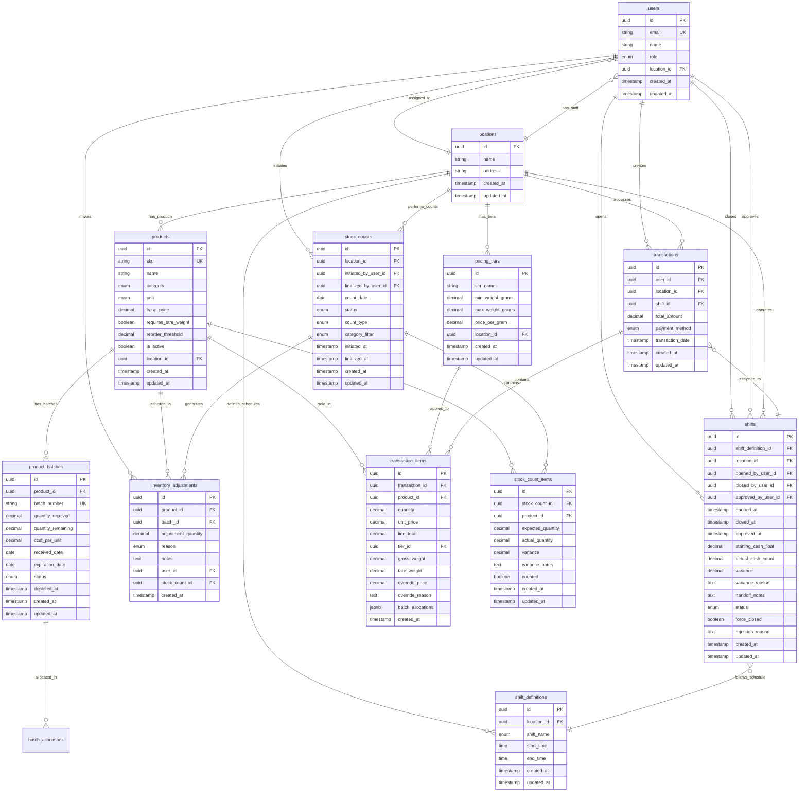

# Database Schema

## Entity Relationship Diagram (ERD)



## PostgreSQL Schema (Supabase)

```sql
-- Enable UUID extension
CREATE EXTENSION IF NOT EXISTS "uuid-ossp";

-- Enable Row-Level Security
ALTER DATABASE postgres SET "app.jwt_secret" TO 'your-jwt-secret';

-- ============================================================================
-- ENUMS
-- ============================================================================

CREATE TYPE user_role AS ENUM ('cashier', 'manager', 'owner');
CREATE TYPE product_category AS ENUM ('Flower', 'Pre-Roll', 'Edible', 'Concentrate', 'Other');
CREATE TYPE product_unit AS ENUM ('gram', 'piece', 'bottle', 'package');
CREATE TYPE batch_status AS ENUM ('Active', 'Depleted');
CREATE TYPE shift_name AS ENUM ('AM', 'PM');
CREATE TYPE shift_status AS ENUM ('Open', 'Pending Approval', 'Approved', 'Rejected', 'Force Closed');
CREATE TYPE payment_method AS ENUM ('Cash', 'Card', 'QR Code');
CREATE TYPE adjustment_reason AS ENUM ('Damage', 'Theft', 'Count Correction', 'Other');
CREATE TYPE stock_count_status AS ENUM ('In Progress', 'Finalized', 'Cancelled');
CREATE TYPE stock_count_type AS ENUM ('Full', 'Cycle');

-- ============================================================================
-- TABLES
-- ============================================================================

-- Locations
CREATE TABLE locations (
  id UUID PRIMARY KEY DEFAULT uuid_generate_v4(),
  name TEXT NOT NULL,
  address TEXT,
  created_at TIMESTAMP WITH TIME ZONE DEFAULT NOW(),
  updated_at TIMESTAMP WITH TIME ZONE DEFAULT NOW()
);

-- Users (extends Supabase auth.users)
CREATE TABLE users (
  id UUID PRIMARY KEY REFERENCES auth.users(id) ON DELETE CASCADE,
  email TEXT UNIQUE NOT NULL,
  name TEXT NOT NULL,
  role user_role NOT NULL DEFAULT 'cashier',
  location_id UUID REFERENCES locations(id) ON DELETE SET NULL,
  created_at TIMESTAMP WITH TIME ZONE DEFAULT NOW(),
  updated_at TIMESTAMP WITH TIME ZONE DEFAULT NOW()
);

-- Products
CREATE TABLE products (
  id UUID PRIMARY KEY DEFAULT uuid_generate_v4(),
  sku TEXT UNIQUE NOT NULL,
  name TEXT NOT NULL,
  category product_category NOT NULL,
  unit product_unit NOT NULL,
  base_price DECIMAL(10, 2) NOT NULL CHECK (base_price >= 0),
  requires_tare_weight BOOLEAN NOT NULL DEFAULT FALSE,
  reorder_threshold DECIMAL(10, 2) NOT NULL DEFAULT 50,
  is_active BOOLEAN NOT NULL DEFAULT TRUE,
  location_id UUID REFERENCES locations(id) ON DELETE SET NULL,
  created_at TIMESTAMP WITH TIME ZONE DEFAULT NOW(),
  updated_at TIMESTAMP WITH TIME ZONE DEFAULT NOW()
);

-- Product Batches
CREATE TABLE product_batches (
  id UUID PRIMARY KEY DEFAULT uuid_generate_v4(),
  product_id UUID NOT NULL REFERENCES products(id) ON DELETE CASCADE,
  batch_number TEXT UNIQUE NOT NULL,
  quantity_received DECIMAL(10, 2) NOT NULL CHECK (quantity_received > 0),
  quantity_remaining DECIMAL(10, 2) NOT NULL CHECK (quantity_remaining >= 0),
  cost_per_unit DECIMAL(10, 2) NOT NULL CHECK (cost_per_unit > 0),
  received_date DATE NOT NULL,
  expiration_date DATE,
  status batch_status NOT NULL DEFAULT 'Active',
  depleted_at TIMESTAMP WITH TIME ZONE,
  created_at TIMESTAMP WITH TIME ZONE DEFAULT NOW(),
  updated_at TIMESTAMP WITH TIME ZONE DEFAULT NOW()
);

-- Pricing Tiers
CREATE TABLE pricing_tiers (
  id UUID PRIMARY KEY DEFAULT uuid_generate_v4(),
  tier_name TEXT NOT NULL,
  min_weight_grams DECIMAL(10, 2) NOT NULL CHECK (min_weight_grams >= 0),
  max_weight_grams DECIMAL(10, 2) CHECK (max_weight_grams IS NULL OR max_weight_grams > min_weight_grams),
  price_per_gram DECIMAL(10, 2) NOT NULL CHECK (price_per_gram > 0),
  location_id UUID REFERENCES locations(id) ON DELETE SET NULL,
  created_at TIMESTAMP WITH TIME ZONE DEFAULT NOW(),
  updated_at TIMESTAMP WITH TIME ZONE DEFAULT NOW(),
  CONSTRAINT no_overlapping_tiers EXCLUDE USING gist (
    numrange(min_weight_grams::numeric, COALESCE(max_weight_grams::numeric, 'infinity'::numeric), '[]') WITH &&
  )
);

-- Shift Definitions
CREATE TABLE shift_definitions (
  id UUID PRIMARY KEY DEFAULT uuid_generate_v4(),
  location_id UUID NOT NULL REFERENCES locations(id) ON DELETE CASCADE,
  shift_name shift_name NOT NULL,
  start_time TIME NOT NULL,
  end_time TIME NOT NULL,
  created_at TIMESTAMP WITH TIME ZONE DEFAULT NOW(),
  updated_at TIMESTAMP WITH TIME ZONE DEFAULT NOW(),
  UNIQUE(location_id, shift_name)
);

-- Shifts
CREATE TABLE shifts (
  id UUID PRIMARY KEY DEFAULT uuid_generate_v4(),
  shift_definition_id UUID NOT NULL REFERENCES shift_definitions(id) ON DELETE CASCADE,
  location_id UUID NOT NULL REFERENCES locations(id) ON DELETE CASCADE,
  opened_by_user_id UUID NOT NULL REFERENCES users(id) ON DELETE RESTRICT,
  closed_by_user_id UUID REFERENCES users(id) ON DELETE RESTRICT,
  approved_by_user_id UUID REFERENCES users(id) ON DELETE RESTRICT,
  opened_at TIMESTAMP WITH TIME ZONE NOT NULL DEFAULT NOW(),
  closed_at TIMESTAMP WITH TIME ZONE,
  approved_at TIMESTAMP WITH TIME ZONE,
  starting_cash_float DECIMAL(10, 2) NOT NULL CHECK (starting_cash_float >= 0),
  actual_cash_count DECIMAL(10, 2) CHECK (actual_cash_count >= 0),
  variance DECIMAL(10, 2),
  variance_reason TEXT,
  handoff_notes TEXT,
  status shift_status NOT NULL DEFAULT 'Open',
  force_closed BOOLEAN NOT NULL DEFAULT FALSE,
  rejection_reason TEXT,
  created_at TIMESTAMP WITH TIME ZONE DEFAULT NOW(),
  updated_at TIMESTAMP WITH TIME ZONE DEFAULT NOW()
);

-- Transactions
CREATE TABLE transactions (
  id UUID PRIMARY KEY DEFAULT uuid_generate_v4(),
  user_id UUID NOT NULL REFERENCES users(id) ON DELETE RESTRICT,
  location_id UUID NOT NULL REFERENCES locations(id) ON DELETE CASCADE,
  shift_id UUID NOT NULL REFERENCES shifts(id) ON DELETE RESTRICT,
  total_amount DECIMAL(10, 2) NOT NULL CHECK (total_amount >= 0),
  payment_method payment_method NOT NULL DEFAULT 'Cash',
  transaction_date TIMESTAMP WITH TIME ZONE NOT NULL DEFAULT NOW(),
  created_at TIMESTAMP WITH TIME ZONE DEFAULT NOW(),
  updated_at TIMESTAMP WITH TIME ZONE DEFAULT NOW()
);

-- Transaction Items
CREATE TABLE transaction_items (
  id UUID PRIMARY KEY DEFAULT uuid_generate_v4(),
  transaction_id UUID NOT NULL REFERENCES transactions(id) ON DELETE CASCADE,
  product_id UUID NOT NULL REFERENCES products(id) ON DELETE RESTRICT,
  quantity DECIMAL(10, 2) NOT NULL CHECK (quantity > 0),
  unit_price DECIMAL(10, 2) NOT NULL CHECK (unit_price >= 0),
  line_total DECIMAL(10, 2) NOT NULL CHECK (line_total >= 0),
  tier_id UUID REFERENCES pricing_tiers(id) ON DELETE SET NULL,
  gross_weight DECIMAL(10, 2) CHECK (gross_weight >= 0),
  tare_weight DECIMAL(10, 2) CHECK (tare_weight >= 0),
  override_price DECIMAL(10, 2) CHECK (override_price >= 0),
  override_reason TEXT,
  batch_allocations JSONB NOT NULL DEFAULT '[]'::jsonb,
  created_at TIMESTAMP WITH TIME ZONE DEFAULT NOW()
);

-- Inventory Adjustments
CREATE TABLE inventory_adjustments (
  id UUID PRIMARY KEY DEFAULT uuid_generate_v4(),
  product_id UUID NOT NULL REFERENCES products(id) ON DELETE CASCADE,
  batch_id UUID NOT NULL REFERENCES product_batches(id) ON DELETE CASCADE,
  adjustment_quantity DECIMAL(10, 2) NOT NULL,
  reason adjustment_reason NOT NULL,
  notes TEXT,
  user_id UUID NOT NULL REFERENCES users(id) ON DELETE RESTRICT,
  stock_count_id UUID REFERENCES stock_counts(id) ON DELETE SET NULL,
  created_at TIMESTAMP WITH TIME ZONE DEFAULT NOW()
);

-- Stock Counts
CREATE TABLE stock_counts (
  id UUID PRIMARY KEY DEFAULT uuid_generate_v4(),
  location_id UUID NOT NULL REFERENCES locations(id) ON DELETE CASCADE,
  initiated_by_user_id UUID NOT NULL REFERENCES users(id) ON DELETE RESTRICT,
  finalized_by_user_id UUID REFERENCES users(id) ON DELETE RESTRICT,
  count_date DATE NOT NULL,
  status stock_count_status NOT NULL DEFAULT 'In Progress',
  count_type stock_count_type NOT NULL DEFAULT 'Full',
  category_filter product_category,
  initiated_at TIMESTAMP WITH TIME ZONE NOT NULL DEFAULT NOW(),
  finalized_at TIMESTAMP WITH TIME ZONE,
  created_at TIMESTAMP WITH TIME ZONE DEFAULT NOW(),
  updated_at TIMESTAMP WITH TIME ZONE DEFAULT NOW()
);

-- Stock Count Items
CREATE TABLE stock_count_items (
  id UUID PRIMARY KEY DEFAULT uuid_generate_v4(),
  stock_count_id UUID NOT NULL REFERENCES stock_counts(id) ON DELETE CASCADE,
  product_id UUID NOT NULL REFERENCES products(id) ON DELETE CASCADE,
  expected_quantity DECIMAL(10, 2) NOT NULL,
  actual_quantity DECIMAL(10, 2),
  variance DECIMAL(10, 2),
  variance_notes TEXT,
  counted BOOLEAN NOT NULL DEFAULT FALSE,
  created_at TIMESTAMP WITH TIME ZONE DEFAULT NOW(),
  updated_at TIMESTAMP WITH TIME ZONE DEFAULT NOW(),
  UNIQUE(stock_count_id, product_id)
);

-- ============================================================================
-- INDEXES
-- ============================================================================

-- Performance indexes
CREATE INDEX idx_products_category ON products(category) WHERE is_active = TRUE;
CREATE INDEX idx_products_location ON products(location_id) WHERE is_active = TRUE;
CREATE INDEX idx_product_batches_product_received ON product_batches(product_id, received_date) WHERE status = 'Active';
CREATE INDEX idx_product_batches_status ON product_batches(status);
CREATE INDEX idx_pricing_tiers_weight_range ON pricing_tiers(min_weight_grams, max_weight_grams);
CREATE INDEX idx_shifts_location_status ON shifts(location_id, status);
CREATE INDEX idx_shifts_opened_by ON shifts(opened_by_user_id);
CREATE INDEX idx_transactions_shift ON transactions(shift_id);
CREATE INDEX idx_transactions_date ON transactions(transaction_date);
CREATE INDEX idx_transaction_items_product ON transaction_items(product_id);
CREATE INDEX idx_inventory_adjustments_product ON inventory_adjustments(product_id);
CREATE INDEX idx_stock_count_items_stock_count ON stock_count_items(stock_count_id);

-- JSONB index for batch allocations
CREATE INDEX idx_transaction_items_batch_alloc ON transaction_items USING gin(batch_allocations);

-- ============================================================================
-- TRIGGERS
-- ============================================================================

-- Updated_at triggers
CREATE OR REPLACE FUNCTION update_updated_at_column()
RETURNS TRIGGER AS $$
BEGIN
  NEW.updated_at = NOW();
  RETURN NEW;
END;
$$ LANGUAGE plpgsql;

CREATE TRIGGER update_locations_updated_at BEFORE UPDATE ON locations
  FOR EACH ROW EXECUTE FUNCTION update_updated_at_column();

CREATE TRIGGER update_users_updated_at BEFORE UPDATE ON users
  FOR EACH ROW EXECUTE FUNCTION update_updated_at_column();

CREATE TRIGGER update_products_updated_at BEFORE UPDATE ON products
  FOR EACH ROW EXECUTE FUNCTION update_updated_at_column();

CREATE TRIGGER update_product_batches_updated_at BEFORE UPDATE ON product_batches
  FOR EACH ROW EXECUTE FUNCTION update_updated_at_column();

CREATE TRIGGER update_pricing_tiers_updated_at BEFORE UPDATE ON pricing_tiers
  FOR EACH ROW EXECUTE FUNCTION update_updated_at_column();

CREATE TRIGGER update_shift_definitions_updated_at BEFORE UPDATE ON shift_definitions
  FOR EACH ROW EXECUTE FUNCTION update_updated_at_column();

CREATE TRIGGER update_shifts_updated_at BEFORE UPDATE ON shifts
  FOR EACH ROW EXECUTE FUNCTION update_updated_at_column();

CREATE TRIGGER update_transactions_updated_at BEFORE UPDATE ON transactions
  FOR EACH ROW EXECUTE FUNCTION update_updated_at_column();

CREATE TRIGGER update_stock_counts_updated_at BEFORE UPDATE ON stock_counts
  FOR EACH ROW EXECUTE FUNCTION update_updated_at_column();

CREATE TRIGGER update_stock_count_items_updated_at BEFORE UPDATE ON stock_count_items
  FOR EACH ROW EXECUTE FUNCTION update_updated_at_column();

-- Auto-calculate shift variance
CREATE OR REPLACE FUNCTION calculate_shift_variance()
RETURNS TRIGGER AS $$
DECLARE
  expected_cash DECIMAL(10, 2);
  total_revenue DECIMAL(10, 2);
BEGIN
  IF NEW.actual_cash_count IS NOT NULL THEN
    -- Calculate total revenue for this shift
    SELECT COALESCE(SUM(total_amount), 0) INTO total_revenue
    FROM transactions
    WHERE shift_id = NEW.id;

    expected_cash := NEW.starting_cash_float + total_revenue;
    NEW.variance := NEW.actual_cash_count - expected_cash;
  END IF;

  RETURN NEW;
END;
$$ LANGUAGE plpgsql;

CREATE TRIGGER trigger_calculate_shift_variance
  BEFORE INSERT OR UPDATE OF actual_cash_count ON shifts
  FOR EACH ROW EXECUTE FUNCTION calculate_shift_variance();

-- Auto-deplete batches when quantity_remaining = 0
CREATE OR REPLACE FUNCTION auto_deplete_batch()
RETURNS TRIGGER AS $$
BEGIN
  IF NEW.quantity_remaining = 0 AND OLD.quantity_remaining > 0 THEN
    NEW.status := 'Depleted';
    NEW.depleted_at := NOW();
  ELSIF NEW.quantity_remaining > 0 AND OLD.status = 'Depleted' THEN
    NEW.status := 'Active';
    NEW.depleted_at := NULL;
  END IF;

  RETURN NEW;
END;
$$ LANGUAGE plpgsql;

CREATE TRIGGER trigger_auto_deplete_batch
  BEFORE UPDATE OF quantity_remaining ON product_batches
  FOR EACH ROW EXECUTE FUNCTION auto_deplete_batch();

-- Auto-calculate stock count variance
CREATE OR REPLACE FUNCTION calculate_stock_count_variance()
RETURNS TRIGGER AS $$
BEGIN
  IF NEW.actual_quantity IS NOT NULL THEN
    NEW.variance := NEW.actual_quantity - NEW.expected_quantity;
    NEW.counted := TRUE;
  END IF;

  RETURN NEW;
END;
$$ LANGUAGE plpgsql;

CREATE TRIGGER trigger_calculate_stock_count_variance
  BEFORE INSERT OR UPDATE OF actual_quantity ON stock_count_items
  FOR EACH ROW EXECUTE FUNCTION calculate_stock_count_variance();
```

## Row-Level Security (RLS) Policies

```sql
-- Enable RLS on all tables
ALTER TABLE users ENABLE ROW LEVEL SECURITY;
ALTER TABLE locations ENABLE ROW LEVEL SECURITY;
ALTER TABLE products ENABLE ROW LEVEL SECURITY;
ALTER TABLE product_batches ENABLE ROW LEVEL SECURITY;
ALTER TABLE pricing_tiers ENABLE ROW LEVEL SECURITY;
ALTER TABLE shift_definitions ENABLE ROW LEVEL SECURITY;
ALTER TABLE shifts ENABLE ROW LEVEL SECURITY;
ALTER TABLE transactions ENABLE ROW LEVEL SECURITY;
ALTER TABLE transaction_items ENABLE ROW LEVEL SECURITY;
ALTER TABLE inventory_adjustments ENABLE ROW LEVEL SECURITY;
ALTER TABLE stock_counts ENABLE ROW LEVEL SECURITY;
ALTER TABLE stock_count_items ENABLE ROW LEVEL SECURITY;

-- Helper function to get current user's role
CREATE OR REPLACE FUNCTION current_user_role()
RETURNS user_role AS $$
  SELECT role FROM users WHERE id = auth.uid();
$$ LANGUAGE sql STABLE SECURITY DEFINER;

-- Helper function to get current user's location
CREATE OR REPLACE FUNCTION current_user_location()
RETURNS UUID AS $$
  SELECT location_id FROM users WHERE id = auth.uid();
$$ LANGUAGE sql STABLE SECURITY DEFINER;

-- ============================================================================
-- USERS TABLE RLS
-- ============================================================================

-- Users can read their own record
CREATE POLICY "Users can read own record" ON users
  FOR SELECT USING (id = auth.uid());

-- Managers and owners can read all users at their location
CREATE POLICY "Managers can read location users" ON users
  FOR SELECT USING (
    current_user_role() IN ('manager', 'owner') AND
    (location_id = current_user_location() OR current_user_role() = 'owner')
  );

-- Only owners can insert/update/delete users
CREATE POLICY "Owners can manage users" ON users
  FOR ALL USING (current_user_role() = 'owner');

-- ============================================================================
-- LOCATIONS TABLE RLS
-- ============================================================================

-- All authenticated users can read locations
CREATE POLICY "Authenticated users can read locations" ON locations
  FOR SELECT TO authenticated USING (TRUE);

-- Only owners can manage locations
CREATE POLICY "Owners can manage locations" ON locations
  FOR ALL USING (current_user_role() = 'owner');

-- ============================================================================
-- PRODUCTS TABLE RLS
-- ============================================================================

-- All authenticated users can read products at their location
CREATE POLICY "Users can read location products" ON products
  FOR SELECT USING (
    is_active = TRUE AND
    (location_id = current_user_location() OR location_id IS NULL OR current_user_role() = 'owner')
  );

-- Managers can insert/update products at their location
CREATE POLICY "Managers can manage products" ON products
  FOR INSERT WITH CHECK (current_user_role() IN ('manager', 'owner'));

CREATE POLICY "Managers can update products" ON products
  FOR UPDATE USING (
    current_user_role() IN ('manager', 'owner') AND
    (location_id = current_user_location() OR current_user_role() = 'owner')
  );

-- ============================================================================
-- PRODUCT_BATCHES TABLE RLS
-- ============================================================================

-- All users can read batches for products they can access
CREATE POLICY "Users can read product batches" ON product_batches
  FOR SELECT USING (
    EXISTS (
      SELECT 1 FROM products p
      WHERE p.id = product_batches.product_id
        AND (p.location_id = current_user_location() OR p.location_id IS NULL OR current_user_role() = 'owner')
    )
  );

-- Managers can manage batches
CREATE POLICY "Managers can manage batches" ON product_batches
  FOR ALL USING (
    current_user_role() IN ('manager', 'owner') AND
    EXISTS (
      SELECT 1 FROM products p
      WHERE p.id = product_batches.product_id
        AND (p.location_id = current_user_location() OR current_user_role() = 'owner')
    )
  );

-- ============================================================================
-- PRICING_TIERS TABLE RLS
-- ============================================================================

-- All users can read pricing tiers for their location
CREATE POLICY "Users can read pricing tiers" ON pricing_tiers
  FOR SELECT USING (
    location_id = current_user_location() OR location_id IS NULL OR current_user_role() = 'owner'
  );

-- Managers can manage pricing tiers
CREATE POLICY "Managers can manage pricing tiers" ON pricing_tiers
  FOR ALL USING (
    current_user_role() IN ('manager', 'owner') AND
    (location_id = current_user_location() OR current_user_role() = 'owner')
  );

-- ============================================================================
-- SHIFTS TABLE RLS
-- ============================================================================

-- All users can read shifts at their location
CREATE POLICY "Users can read location shifts" ON shifts
  FOR SELECT USING (
    location_id = current_user_location() OR current_user_role() = 'owner'
  );

-- Cashiers can insert their own shifts (open shift)
CREATE POLICY "Cashiers can open shifts" ON shifts
  FOR INSERT WITH CHECK (
    location_id = current_user_location() AND
    opened_by_user_id = auth.uid()
  );

-- Cashiers can update their own shifts (close shift)
CREATE POLICY "Cashiers can close own shifts" ON shifts
  FOR UPDATE USING (
    opened_by_user_id = auth.uid() AND
    location_id = current_user_location()
  );

-- Managers can approve/reject/force-close shifts
CREATE POLICY "Managers can manage all shifts" ON shifts
  FOR UPDATE USING (
    current_user_role() IN ('manager', 'owner') AND
    (location_id = current_user_location() OR current_user_role() = 'owner')
  );

-- ============================================================================
-- TRANSACTIONS TABLE RLS
-- ============================================================================

-- Users can read transactions at their location
CREATE POLICY "Users can read location transactions" ON transactions
  FOR SELECT USING (
    location_id = current_user_location() OR current_user_role() = 'owner'
  );

-- Cashiers can insert transactions
CREATE POLICY "Cashiers can create transactions" ON transactions
  FOR INSERT WITH CHECK (
    location_id = current_user_location() AND
    user_id = auth.uid()
  );

-- ============================================================================
-- TRANSACTION_ITEMS TABLE RLS
-- ============================================================================

-- Users can read transaction items for transactions they can access
CREATE POLICY "Users can read transaction items" ON transaction_items
  FOR SELECT USING (
    EXISTS (
      SELECT 1 FROM transactions t
      WHERE t.id = transaction_items.transaction_id
        AND (t.location_id = current_user_location() OR current_user_role() = 'owner')
    )
  );

-- Cashiers can insert transaction items
CREATE POLICY "Cashiers can create transaction items" ON transaction_items
  FOR INSERT WITH CHECK (
    EXISTS (
      SELECT 1 FROM transactions t
      WHERE t.id = transaction_items.transaction_id
        AND t.location_id = current_user_location()
        AND t.user_id = auth.uid()
    )
  );

-- ============================================================================
-- INVENTORY_ADJUSTMENTS TABLE RLS
-- ============================================================================

-- All users can read adjustments for products they can access
CREATE POLICY "Users can read inventory adjustments" ON inventory_adjustments
  FOR SELECT USING (
    EXISTS (
      SELECT 1 FROM products p
      WHERE p.id = inventory_adjustments.product_id
        AND (p.location_id = current_user_location() OR p.location_id IS NULL OR current_user_role() = 'owner')
    )
  );

-- Managers can create adjustments
CREATE POLICY "Managers can create adjustments" ON inventory_adjustments
  FOR INSERT WITH CHECK (
    current_user_role() IN ('manager', 'owner') AND
    user_id = auth.uid()
  );

-- ============================================================================
-- STOCK_COUNTS TABLE RLS
-- ============================================================================

-- Users can read stock counts at their location
CREATE POLICY "Users can read location stock counts" ON stock_counts
  FOR SELECT USING (
    location_id = current_user_location() OR current_user_role() = 'owner'
  );

-- Managers can manage stock counts
CREATE POLICY "Managers can manage stock counts" ON stock_counts
  FOR ALL USING (
    current_user_role() IN ('manager', 'owner') AND
    (location_id = current_user_location() OR current_user_role() = 'owner')
  );

-- ============================================================================
-- STOCK_COUNT_ITEMS TABLE RLS
-- ============================================================================

-- Users can read/update stock count items for counts they can access
CREATE POLICY "Users can read stock count items" ON stock_count_items
  FOR SELECT USING (
    EXISTS (
      SELECT 1 FROM stock_counts sc
      WHERE sc.id = stock_count_items.stock_count_id
        AND (sc.location_id = current_user_location() OR current_user_role() = 'owner')
    )
  );

CREATE POLICY "Users can update stock count items" ON stock_count_items
  FOR UPDATE USING (
    EXISTS (
      SELECT 1 FROM stock_counts sc
      WHERE sc.id = stock_count_items.stock_count_id
        AND (sc.location_id = current_user_location() OR current_user_role() = 'owner')
        AND sc.status = 'In Progress'
    )
  );
```

---
