# High Level Architecture

## Technical Summary

CannaPOS Thailand is a **client-side SPA + managed backend** architecture leveraging Vercel (frontend hosting) and Supabase (managed PostgreSQL + Auth + Storage + Real-time). The React 18+ frontend communicates with Supabase via auto-generated REST/GraphQL APIs, with Row-Level Security (RLS) policies enforcing authorization at the database layer. This architecture eliminates custom backend code, accelerating the 12-week timeline while maintaining enterprise-grade security and scalability. Real-time subscriptions enable live cart updates and shift dashboards, critical for multi-user POS environments. The system prioritizes tablet-optimized touch interfaces for sub-90-second transaction times, with aggressive code splitting and caching to meet <3s page load targets on 4G networks.

## Platform and Infrastructure Choice

**Platform**: Vercel (Frontend) + Supabase (Backend)

**Rationale**:
- **Rapid Development**: Supabase eliminates need for custom API layer, auth system, and database management
- **Auto-Scaling**: Both platforms scale automatically without infrastructure management
- **Cost-Effective**: Free tiers support MVP + pilot, predictable pricing for scale
- **Developer Experience**: Excellent DX with instant deploys (Vercel) and auto-generated TypeScript clients (Supabase)
- **Real-Time Built-In**: Supabase real-time subscriptions critical for POS cart updates and shift dashboards
- **RLS Security**: Database-level authorization prevents data leaks without custom middleware

**Key Services**:
- **Vercel**: Frontend hosting, edge CDN, preview deployments, GitHub integration
- **Supabase**:
  - PostgreSQL 15+ (managed database with extensions)
  - Auth (email/password, JWT tokens, RLS integration)
  - Storage (product images - future enhancement)
  - Real-time (WebSocket subscriptions for live updates)
  - Edge Functions (if needed for complex server-side logic)

**Deployment Host and Regions**:
- **Vercel**: Global edge network with Asia-Pacific optimization (Singapore, Tokyo)
- **Supabase**: Southeast Asia region (Singapore) for minimal latency to Thailand

## Repository Structure

**Structure**: Monorepo

**Rationale**:
- Share TypeScript types between frontend and database schemas
- Atomic commits across database migrations and UI changes
- Simplified CI/CD with single repository
- Easier for AI agents to maintain context

**Monorepo Tool**: pnpm workspaces (lightweight, fast, built-in to pnpm)

**Package Organization**:
```
/
├── apps/
│   └── web/              # React SPA (only app for MVP)
├── packages/
│   └── shared-types/     # Shared TypeScript interfaces
├── supabase/            # Database migrations, RLS policies, Edge Functions
└── package.json         # Root workspace config
```

## High Level Architecture Diagram

```mermaid
graph TD
    User[👤 Cashier/Manager<br/>iPad / Desktop] -->|HTTPS| Vercel[Vercel Edge CDN<br/>React SPA]

    Vercel -->|REST/GraphQL API<br/>via Supabase Client| SupabaseAPI[Supabase API Gateway]

    SupabaseAPI -->|Auth Tokens| SupabaseAuth[Supabase Auth<br/>JWT + RLS]
    SupabaseAPI -->|Query/Mutation| SupabaseDB[(Supabase PostgreSQL<br/>RLS Policies)]
    SupabaseAPI -->|Subscribe| SupabaseRealtime[Supabase Real-time<br/>WebSocket]

    SupabaseDB -->|Change Events| SupabaseRealtime
    SupabaseRealtime -->|Live Updates| Vercel

    Vercel -->|Future: Images| SupabaseStorage[Supabase Storage<br/>Product Images]

    GitHub[GitHub Repository] -->|Push to main| GHA[GitHub Actions<br/>CI/CD]
    GHA -->|Deploy Frontend| Vercel
    GHA -->|Run Migrations| SupabaseDB

    style User fill:#e1f5ff
    style Vercel fill:#ffe1e1
    style SupabaseDB fill:#e1ffe1
    style SupabaseAuth fill:#fff9e1
```



## Architectural Patterns

- **Jamstack Architecture**: Static SPA served from CDN + serverless backend (Supabase) - *Rationale:* Optimal performance, global scalability, minimal operational overhead

- **Component-Based UI**: React functional components with TypeScript - *Rationale:* Reusability, type safety, excellent tooling ecosystem

- **Database-Centric Authorization**: Row-Level Security (RLS) policies in PostgreSQL - *Rationale:* Security enforced at data layer, impossible to bypass via API

- **Optimistic UI Updates**: Client-side state updates before server confirmation - *Rationale:* Perceived performance for <100ms interaction response

- **FIFO Allocation Pattern**: Batch inventory allocated from oldest received_date first - *Rationale:* Product freshness, accurate COGS calculation

- **State Machine Pattern**: Shift lifecycle (Open → Pending Approval → Approved/Rejected) - *Rationale:* Clear state transitions, prevents invalid operations

- **Repository Pattern**: Abstract Supabase queries behind service layer - *Rationale:* Testability, future database migration flexibility

---
