# Security Model

## Authentication Flow

```mermaid
sequenceDiagram
    participant User as 👤 User
    participant App as React App
    participant SA as Supabase Auth
    participant DB as PostgreSQL + RLS

    User->>App: Enter email/password
    App->>SA: supabase.auth.signInWithPassword()
    SA->>SA: Verify credentials
    SA-->>App: JWT token + user data
    App->>App: Store token (localStorage)
    App->>App: Set AuthContext state

    App->>DB: Query users table (with JWT)
    DB->>DB: Verify JWT signature
    DB->>DB: Extract user.id from JWT
    DB->>DB: Apply RLS policies
    DB-->>App: User data (name, role, location_id)

    App->>App: Navigate to POS

    Note over App,DB: All subsequent queries include JWT
    App->>DB: Query products (with JWT)
    DB->>DB: Apply RLS: location_id filter
    DB-->>App: Products for user's location
```



## RLS Policy Definitions

**Key Principles**:
1. **Default Deny**: All tables have RLS enabled, no access by default
2. **JWT-Based**: All policies extract user.id from JWT token via `auth.uid()`
3. **Role-Based**: Helper functions `current_user_role()` and `current_user_location()` simplify policies
4. **Location Isolation**: Cashiers/managers see only their location's data, owners see all
5. **Audit Trail Immutability**: Transaction items, inventory adjustments are insert-only (no update/delete)

**Example Policies** (see Database Schema section for complete policies):

- **Cashiers** can:
  - Read products at their location
  - Create transactions at their location
  - Open/close their own shifts
  - Read shifts at their location

- **Managers** can (in addition to cashier):
  - Create/edit products and batches
  - Approve/reject shifts
  - Force-close abandoned shifts
  - Create inventory adjustments
  - Manage stock counts

- **Owners** can (in addition to manager):
  - Read data from all locations
  - Manage users across locations
  - Manage locations

**Token Storage**: JWT tokens stored in `localStorage` (Supabase default). For enhanced security in production:
- Consider `httpOnly` cookies (requires Supabase Edge Functions proxy)
- Implement token refresh before expiry (Supabase handles automatically)

---

## Role-Based Access Control (RBAC)

**Roles** (defined in `user_role` enum):
- `cashier`: Basic POS access, can create transactions, open/close own shifts
- `manager`: All cashier permissions + product management, shift approval, inventory adjustments, reports
- `owner`: All manager permissions + multi-location access, user management

**Frontend Route Guards** (components/layout/ProtectedRoute.tsx):

```typescript
import { useAuth } from '@/contexts/AuthContext';
import { Navigate, Outlet } from 'react-router-dom';
import type { UserRole } from '@/types';

interface ProtectedRouteProps {
  allowedRoles?: UserRole[];
  requiresShift?: boolean;
}

export function ProtectedRoute({ allowedRoles, requiresShift = false }: ProtectedRouteProps) {
  const { user, loading } = useAuth();
  const { currentShift } = useShiftStore();

  if (loading) {
    return <LoadingSpinner />;
  }

  if (!user) {
    return <Navigate to="/login" replace />;
  }

  if (allowedRoles && !allowedRoles.includes(user.role)) {
    return <div>Access Denied. Insufficient permissions.</div>;
  }

  if (requiresShift && !currentShift) {
    return <ShiftOpenModal />;
  }

  return <Outlet />;
}

// Usage in router:
<Route element={<ProtectedRoute />}>
  <Route path="pos" element={<POSPage />} />
</Route>

<Route element={<ProtectedRoute allowedRoles={['manager', 'owner']} />}>
  <Route path="settings" element={<SettingsPage />} />
</Route>
```

---
