```mermaid
graph TD
    START[Cashier taps<br/>'Close Shift' button] --> MODAL[Shift Close Modal<br/>displays]

    MODAL --> SUMMARY[Shows shift summary:<br/>- Starting cash float<br/>- Transaction count<br/>- Total revenue<br/>- Expected cash]

    SUMMARY --> ENTER_ACTUAL[Cashier enters<br/>actual cash count]
    ENTER_ACTUAL --> CALC_VAR[System calculates<br/>variance = actual - expected]

    CALC_VAR --> CHECK_VAR{Variance<br/>> ฿50?}

    CHECK_VAR -->|Yes, Large| VAR_COLOR_RED[Display variance<br/>in RED]
    VAR_COLOR_RED --> REASON_REQ[Variance reason<br/>field REQUIRED]

    CHECK_VAR -->|฿11-50, Medium| VAR_COLOR_AMBER[Display variance<br/>in AMBER]
    VAR_COLOR_AMBER --> REASON_OPT[Variance reason<br/>optional but suggested]

    CHECK_VAR -->|฿0-10, Small| VAR_COLOR_GREEN[Display variance<br/>in GREEN]
    VAR_COLOR_GREEN --> REASON_OPT

    REASON_REQ --> NOTES[Optional:<br/>Cashier adds handoff notes]
    REASON_OPT --> NOTES

    NOTES --> SUBMIT[Tap 'Submit for<br/>Approval' button]

    SUBMIT --> VALIDATE{Validation}
    VALIDATE -->|Missing required<br/>variance reason| ERROR[Show inline error<br/>'Variance >฿50 requires reason']
    ERROR --> REASON_REQ

    VALIDATE -->|All valid| SAVE[System saves:<br/>- Shift record<br/>- Status: Pending Approval<br/>- Actual cash, variance, reason<br/>- Closed timestamp]

    SAVE --> NOTIFY[Notify manager<br/>if variance > ฿100]
    NOTIFY --> RESTRICT[POS access restricted<br/>until next shift opened]
    RESTRICT --> SUCCESS[Success message:<br/>'Shift closed.<br/>Awaiting manager approval.']
    SUCCESS --> END[Return to login/shift open]
```

# Cannabis Dispensary POS System - UI/UX Specification

## Introduction

This document defines the user experience goals, information architecture, user flows, and visual design specifications for CannaPOS Thailand's user interface. It serves as the foundation for visual design and frontend development, ensuring a cohesive and user-centered experience optimized for tablet-based retail operations with sub-90-second transaction times.

### Overall UX Goals & Principles

#### Target User Personas

**Cashier (Primary User)**
- **Profile**: Dispensary staff working 6-hour shifts in fast-paced retail environment
- **Technical Comfort**: Low to medium - familiar with Square/similar POS systems
- **Goals**: Complete transactions quickly (<90s), minimize errors, easy shift handover
- **Pain Points**: Manual tiered pricing calculation, tare weight confusion, shift variance stress
- **Device**: 10.2" iPad or Android tablet, primarily touch input
- **Key Needs**: Large touch targets (44px min), real-time price feedback, clear variance indicators

**Store Manager (Secondary User)**
- **Profile**: Dispensary manager responsible for inventory, staff oversight, and reconciliation
- **Technical Comfort**: Medium - comfortable with reports, dashboards, configuration
- **Goals**: Monitor inventory, approve shifts, identify theft/errors, optimize pricing
- **Pain Points**: Lack of real-time visibility, manual reconciliation, slow report generation
- **Device**: Desktop/laptop for reports, tablet for on-floor management
- **Key Needs**: Quick-access dashboards, variance alerts, drill-down capabilities

**Store Owner (Tertiary User)**
- **Profile**: Multi-location dispensary owner focused on profitability and fraud prevention
- **Technical Comfort**: Medium to high - strategic focus on KPIs and cross-location comparison
- **Goals**: Track performance across locations, identify underperforming stores, prevent revenue leakage
- **Pain Points**: No consolidated multi-location view, delayed insights, can't benchmark
- **Device**: Desktop/laptop, occasional tablet
- **Key Needs**: Executive dashboards, location comparison, trend analysis

#### Usability Goals

1. **Transaction Speed**: Cashiers complete full POS transaction in <90 seconds (search → add → tare → tier → checkout)
2. **Error Prevention**: Tier pricing and FIFO allocation are automatic and transparent - zero manual calculation
3. **Shift Accountability**: Shift open/close workflows are mandatory gates - cannot be bypassed or forgotten
4. **Learnability**: New cashiers can complete first supervised transaction within 5 minutes of training
5. **Touch Optimization**: All interactive elements meet 44px minimum tap target, generous spacing for fat-finger errors
6. **Real-Time Feedback**: Every cart change immediately updates tier pricing, totals, and inventory availability
7. **Accessibility**: WCAG 2.1 Level AA compliance ensures usability for all staff members

#### Design Principles

1. **Speed Through Simplicity** - Every click removed is a second saved. Single-screen workflows prevent navigation overhead.

2. **Transparency Builds Trust** - Show tier calculations, FIFO batch allocations, and variance breakdowns visibly so staff understand the "why" behind numbers.

3. **Touch-First, Always** - Design for fingers, not mice. No hover states, no tiny targets, no precise drag operations.

4. **Mandatory Guardrails** - Shift reconciliation and inventory checks are gates, not suggestions. System architecture prevents workarounds.

5. **Progressive Disclosure** - Advanced features (manager overrides, batch details, report filters) are hidden until needed to keep primary flows uncluttered.

### Change Log

| Date       | Version | Description                           | Author |
| ---------- | ------- | ------------------------------------- | ------ |
| 2025-01-10 | 1.0     | Initial UX Spec created from PRD v1.0 | Sally  |

---

## Information Architecture (IA)

### Site Map / Screen Inventory


### Navigation Structure

**Primary Navigation** (Side Navigation Menu)

Persistent left sidebar (collapsible on mobile/tablet) with icon + label:

- 🛒 **POS** - Always highlighted when on POS screen, quick return to main transaction flow
- 📦 **Products** - Product catalog, batch receiving, product management
- 📊 **Inventory** - Stock levels, stock counts, batch tracking
- 🔄 **Shifts** - Shift summary, history, reconciliation approvals
- 📈 **Reports** - Report hub, all 10 MVP reports
- 🏢 **Dashboard** - Multi-location overview (owner/manager only)
- ⚙️ **Settings** - Tier config, shift definitions, user management (manager only)
- 👤 **Profile** - User profile, logout

**Secondary Navigation**

- **Breadcrumbs**: Used in Product Detail, Report Drilldowns - shows path (e.g., "Reports > Sales by Category > Flower")
- **Tabs**: Used in Product Detail (Info, Batches, History), Reports (different report types)
- **Action Buttons**: Context-specific actions in top-right (e.g., "Receive Batch", "Start Stock Count", "Export CSV")

**Breadcrumb Strategy**

- Display breadcrumbs on drill-down screens (Product Detail, Report Details, Batch History)
- Format: `Section > Subsection > Current Page`
- Each breadcrumb segment is clickable for quick navigation up the hierarchy
- Mobile: Collapse to "< Back" button to save space

**Shift Status Bar** (Global)

Always visible at top of screen showing:
- Current shift name (AM/PM)
- Time remaining in shift
- Transaction count
- Total revenue
- Expected cash
- "Close Shift" button (when within 30 min of end time)

---

## User Flows

### Flow 1: Complete POS Transaction (Flower with Tare Weight)

**User Goal**: Cashier completes sale of 2 flower products requiring tare weight measurement in <90 seconds.

**Entry Points**: POS Main Screen (after shift opened)

**Success Criteria**: Transaction recorded, receipt displayed, inventory updated via FIFO, tier pricing applied correctly, all in <90s.

#### Flow Diagram


#### Edge Cases & Error Handling

- **Insufficient Inventory**: If FIFO allocation fails (not enough stock), error modal displays: "Insufficient inventory for {product_name}. Available: {qty}g, Requested: {qty}g" with options to adjust quantity or remove item.
- **No Shift Open**: If cashier somehow reaches POS without open shift (shouldn't happen), block transaction with "No active shift. Please open shift first."
- **Tare > Gross Weight**: Modal validates gross > tare, displays error "Tare weight cannot exceed gross weight" inline.
- **Network Error During Checkout**: If Supabase unreachable, display "Network error. Transaction not saved. Please retry." Cart preserved, transaction rolled back.
- **Tier Pricing Fetch Fails**: Fall back to base_price, display amber banner "Pricing temporarily unavailable, using base prices" and log error.

**Notes**: This is the most critical flow - must be optimized for speed. Target: <60s for experienced cashiers, <90s for new staff.

---

### Flow 2: Shift Reconciliation (Close Shift)

**User Goal**: Cashier closes shift, enters cash count, resolves variance if needed.

**Entry Points**: POS Main Screen → "Close Shift" button (visible in last 30 min of shift)

**Success Criteria**: Shift closed, variance calculated, submitted for manager approval.

#### Flow Diagram



#### Edge Cases & Error Handling

- **Transaction in Progress**: If cashier tries to close shift with open transaction in cart, block with error "Cannot close shift with active transaction. Complete or cancel current sale."
- **Manager Force Close**: If shift left open >24 hours, manager can force close with override notes. Original cashier notified.
- **Shift Already Closed**: If duplicate close attempt (race condition), detect and display "Shift already closed at {timestamp}."
- **Network Failure During Submit**: Preserve shift data locally, display "Unable to submit shift. Retrying..." and auto-retry every 30s until successful.

**Notes**: Variance color-coding is critical for quick visual assessment. Green = no concern, Amber = review, Red = requires explanation.

---

### Flow 3: Weekly Stock Count

**User Goal**: Manager initiates weekly stock count, staff counts all products, manager reviews variances and finalizes adjustments.

**Entry Points**: Inventory Dashboard → "Start Stock Count" button

**Success Criteria**: All products counted, variances identified, inventory adjusted to match physical count.

#### Flow Diagram

```mermaid
graph TD
    START[Manager taps<br/>'Start Stock Count'<br/>on Inventory Dashboard] --> INIT[System creates<br/>stock_count record<br/>status: In Progress]

    INIT --> SNAPSHOT[System snapshots<br/>current inventory quantities<br/>as baseline]

    SNAPSHOT --> SCREEN[Stock Count Screen<br/>displays all products]
    SCREEN --> LIST[Product list shows:<br/>- Product name, SKU<br/>- Expected qty (from system)<br/>- Actual qty (empty input)<br/>- Category filter<br/>- Progress: 0/{total} counted]

    LIST --> COUNT1[Staff counts<br/>Product 1 physically]
    COUNT1 --> ENTER1[Enter actual qty<br/>in input field]
    ENTER1 --> VAR_CALC[System calculates<br/>variance = actual - expected<br/>in real-time]

    VAR_CALC --> CHECK_VAR{High<br/>variance?}
    CHECK_VAR -->|>10% or >10 units| HIGHLIGHT[Highlight row<br/>in AMBER/RED]
    CHECK_VAR -->|Normal| CHECKMARK[Show green<br/>checkmark icon]

    HIGHLIGHT --> CHECKMARK
    CHECKMARK --> PROGRESS[Progress updates:<br/>1/{total} counted]

    PROGRESS --> LOOP{More<br/>products?}
    LOOP -->|Yes| COUNT1
    LOOP -->|No, All counted| REVIEW_BTN['Review Count'<br/>button enabled]

    REVIEW_BTN --> REVIEW_SCREEN[Variance Review Screen]
    REVIEW_SCREEN --> VAR_TABLE[Table shows only<br/>products with variance ≠ 0]
    VAR_TABLE --> SUMMARY[Summary statistics:<br/>- Total products counted<br/>- Products with variance<br/>- Total positive variance<br/>- Total negative variance]

    SUMMARY --> MANAGER_REVIEW[Manager reviews<br/>high variance items]
    MANAGER_REVIEW --> ADD_NOTES[Optional: Add notes<br/>to explain variances]
    ADD_NOTES --> FINALIZE[Manager taps<br/>'Finalize Count']

    FINALIZE --> ADJUSTMENTS[System creates<br/>inventory_adjustments<br/>for all variances]
    ADJUSTMENTS --> UPDATE_BATCHES[Update batch quantities:<br/>quantity_remaining += variance]
    UPDATE_BATCHES --> LOCK[Set stock_count<br/>status: Finalized<br/>locked from editing]

    LOCK --> REPORT[Generate variance report<br/>for audit trail]
    REPORT --> CONFIRM[Confirmation:<br/>'{positive_count} items increased<br/>{negative_count} items decreased']
    CONFIRM --> END[Return to Inventory Dashboard]
```

#### Edge Cases & Error Handling

- **Count in Progress**: Only one stock count can be active per location. If "Start Stock Count" clicked with existing count, offer to "Resume" or "Cancel Previous Count".
- **Partial Count Save**: Auto-save count entries every 30 seconds to prevent data loss. Staff can leave and resume later.
- **Skip Products**: "Skip" button marks product for later count. Progress shows "X/Y counted, Z skipped".
- **Recount**: On review screen, each variance item has "Recount" button to re-open that product's count entry.
- **Network Interruption**: Queue adjustments locally, sync when connection restored. Display "Offline - changes will sync when reconnected."

**Notes**: Tablet-optimized for one-handed operation during physical counting. Large numeric keypad for quick entry.

---

### Flow 4: Tiered Pricing in Real-Time

**User Goal**: Cashier adds multiple flower products to cart and sees tier pricing update automatically as total flower weight crosses tier thresholds.

**Entry Points**: POS Main Screen, adding flower products to cart

**Success Criteria**: Tier indicator updates in real-time, price recalculated, tier progression shows estimated savings.

#### Flow Diagram

```mermaid
graph TD
    START[Cart initially empty] --> ADD1[Add 1.5g<br/>Flower Product A]
    ADD1 --> CALC1[Total flower weight: 1.5g<br/>Tier 1: 0-2.99g @ ฿400/g]
    CALC1 --> DISPLAY1[Cart shows:<br/>- Product A: 1.5g @ ฿400/g = ฿600<br/>- Tier indicator: Tier 1<br/>- Progression: 'Add 1.5g to reach Tier 2']

    DISPLAY1 --> ADD2[Add 2g<br/>Flower Product B]
    ADD2 --> CALC2[Total flower weight: 3.5g<br/>Crosses threshold!<br/>Tier 2: 3-6.99g @ ฿350/g]

    CALC2 --> REPRICE[System reprices<br/>ALL flower items:<br/>- Product A: 1.5g @ ฿350/g = ฿525<br/>- Product B: 2g @ ฿350/g = ฿700]

    REPRICE --> DISPLAY2[Cart updates:<br/>- Total flower weight: 3.5g<br/>- Tier indicator: Tier 2<br/>- Progression: 'Add 3.5g to reach Tier 3 and save ฿50/g'<br/>- Subtotal recalculated]

    DISPLAY2 --> VISUAL[Visual feedback:<br/>- Tier badge changes color<br/>- Subtle animation on price update<br/>- Savings badge shows 'Saved ฿75']

    VISUAL --> ADD_ACCESSORY[Add non-flower<br/>product (Pre-Roll)]
    ADD_ACCESSORY --> MIX[Mixed cart:<br/>- Flower total: 3.5g @ Tier 2<br/>- Pre-Roll: base_price<br/>- Tier calc ignores non-flower]

    MIX --> DISPLAY3[Cart shows breakdown:<br/>- Flower Subtotal: ฿1,225<br/>- Other Products: ฿150<br/>- Total: ฿1,375]

    DISPLAY3 --> ADJUST[User reduces<br/>Product B to 1g]
    ADJUST --> RECALC[Total flower: 2.5g<br/>Falls below Tier 2!<br/>Back to Tier 1]

    RECALC --> REPRICE2[Reprice back to ฿400/g<br/>- Product A: 1.5g @ ฿400/g = ฿600<br/>- Product B: 1g @ ฿400/g = ฿400]

    REPRICE2 --> WARNING[Warning indicator:<br/>'Add 0.5g to reach Tier 2<br/>and save ฿50/g']

    WARNING --> END[User completes<br/>or continues shopping]
```

#### Edge Cases & Error Handling

- **No Tiers Configured**: If pricing_tiers table empty, fall back to base_price for all flower products, display warning banner "Tier pricing unavailable, using base prices."
- **Overlapping Tiers**: Should not occur due to validation, but if data integrity issue, use lowest price tier and log error.
- **Tier Fetch Timeout**: If query takes >2 seconds, use cached tiers (if available) or fall back to base_price.
- **Mixed Units**: All flower products assumed to be in grams. If unit mismatch, exclude from tier calculation (edge case - should not occur in MVP).
- **Negative Quantities**: Validation prevents negative qty, but if race condition occurs, display error "Invalid quantity. Please refresh."

**Notes**: Real-time recalculation is critical for UX - must feel instant (<100ms). Tier progression indicator encourages upselling.

---

## Wireframes & Mockups

### Primary Design Files

**Figma Project**: [Cannabis POS - UI/UX Designs](#) *(To be created - link placeholder)*

**Component Storybook**: [Storybook - shadcn/ui Components](#) *(Development phase)*

---

### Key Screen Layouts

#### POS Main Screen (Tablet Landscape - Primary View)

**Purpose**: Primary transaction screen optimized for speed. Single-screen workflow prevents navigation overhead during checkout.

**Layout** (1024×768 iPad landscape):

```
┌──────────────────────────────────────────────────────────────────────┐
│ [Logo] CannaPOS    Shift: AM 🟢   Time: 2:30 remaining   ₿2,450   │ ← Shift Status Bar (always visible)
│ John (Cashier)                     Transactions: 12    [Close Shift]│
├────────────────────────────────────────┬─────────────────────────────┤
│ [≡] Navigation Menu                   │                             │
│   🛒 POS (active)                      │    🛒 Cart (3 items)       │ ← Cart Sidebar (fixed right, 320px)
│   📦 Products                          │                             │
│   📊 Inventory                         │    Tier 2: 3-6.99g         │ ← Tier Indicator
│   🔄 Shifts                            │    @ ฿350/g                 │
│   📈 Reports                           │                             │
│   👤 Profile                           │    Add 3g to reach Tier 3   │ ← Tier Progression
│   [Logout]                             │    Save ฿50/g               │
├────────────────────────────────────────┤                             │
│                                        │    [Product A]              │
│  🔍 Search products...                 │    1.5g @ ฿350  ฿525        │ ← Cart Items
│  [X] (clear)                           │    [- 1.5 +] [×]            │   (quantity adjust, remove)
│                                        │                             │
│  ┌──────┬──────┬──────┬──────┐        │    [Product B - Tare]       │
│  │Img  │ Img  │ Img  │ Img  │        │    2g @ ฿350   ฿700         │
│  │FlwA │ FlwB │ Pre  │ Edib │        │    [- 2.0 +] [×]            │
│  │฿400 │ ฿350 │ ฿150 │ ฿200 │        │    Gross: 4g, Tare: 2g      │
│  │5g   │ LOW  │ 50   │ 30   │        │                             │
│  └──────┴──────┴──────┴──────┘        │    [Pre-Roll C]             │
│                                        │    1pc @ ฿150  ฿150         │
│  ┌──────┬──────┬──────┬──────┐        │    [- 1 +] [×]              │
│  │      │      │      │      │        │                             │
│  │ ...  │ ...  │ ...  │ ...  │        │    ─────────────────        │
│  │      │      │      │      │        │    Flower: ฿1,225           │
│  └──────┴──────┴──────┴──────┘        │    Other:  ฿150             │
│                                        │    ─────────────────        │
│  [Load More] (infinite scroll)         │    Total:  ฿1,375           │ ← Running Total (large, prominent)
│                                        │                             │
│                                        │    [Complete Sale]          │ ← Primary Action Button
│                                        │    (Large, green, 100%)     │   (Full width, touch-optimized)
└────────────────────────────────────────┴─────────────────────────────┘
```

**Key Elements**:
- **Product Grid**: 4 columns × infinite scroll, each card 180×220px with 16px gap
- **Product Card**: Image, name, price, stock level (color-coded: green >20, amber <20, red =0)
- **Search Bar**: Auto-focus on load, real-time filter (debounced 300ms)
- **Cart Sidebar**: Fixed right, 320px wide, sticky positioning
- **Tier Indicator**: Badge style, color-coded by tier (Tier 1: gray, Tier 2: blue, Tier 3: green, etc.)
- **Tier Progression**: Shows weight needed + estimated savings, encourages upselling
- **Cart Items**: Each item 72px height, quantity buttons ±, remove × button (44×44px tap targets)
- **Complete Sale Button**: 100% width, 56px height, green (#22c55e), bold text

**Interaction Notes**:
- Tapping product card immediately adds to cart (if no tare weight required)
- If tare weight required, opens Tare Weight Modal
- Cart updates animate with 200ms ease-out transition
- Tier badge pulses briefly when tier changes (300ms scale animation)
- Search focuses on screen load for quick keyboard entry

**Design File Reference**: `Figma > POS Main Screen > Tablet Landscape`

---

#### Tare Weight Modal

**Purpose**: Capture gross and tare weight for flower products, calculate net weight, prevent errors.

**Layout** (Modal overlay, centered):

```
┌─────────────────────────────────────────┐
│   Weigh Product: Superboof              │ ← Product Name
│                                         │
│   ┌───────────────────────────────────┐ │
│   │  Gross Weight (with container)    │ │
│   │  ┌─────────────────────┐          │ │
│   │  │       5.5      g    │ [X]      │ │ ← Numeric Input (large, touch-friendly)
│   │  └─────────────────────┘          │ │   Clear button
│   └───────────────────────────────────┘ │
│                                         │
│   ┌───────────────────────────────────┐ │
│   │  Tare Weight (container only)     │ │
│   │  ┌─────────────────────┐          │ │
│   │  │       2.0      g    │ [X]      │ │
│   │  └─────────────────────┘          │ │
│   └───────────────────────────────────┘ │
│                                         │
│   ═════════════════════════════════════ │
│   Net Weight: 3.5g                     │ ← Auto-calculated (gross - tare)
│   ═════════════════════════════════════ │   Large, bold, green
│                                         │
│   ⚠️  Error: Tare cannot exceed gross   │ ← Inline Validation (if error)
│                                         │   Hidden when valid
│   [Cancel]           [Add to Cart]     │ ← Action Buttons
│   (gray, 48px)       (green, 48px)     │   (Touch-optimized, 48px height)
└─────────────────────────────────────────┘
```

**Key Elements**:
- **Numeric Inputs**: 56px height, 24px font size, right-aligned with "g" suffix
- **Clear Buttons**: × icon, 32×32px, clears input field
- **Net Weight Display**: 32px font, bold, green color (#22c55e), auto-updates on input change
- **Error Message**: Red banner (#ef4444), appears below net weight when validation fails
- **Cancel Button**: 48px height, gray (#6b7280), closes modal without adding to cart
- **Add to Cart Button**: 48px height, green (#22c55e), disabled if validation fails

**Interaction Notes**:
- Modal dims background (black 50% opacity overlay)
- Auto-focus gross weight input on open
- Tab key moves from gross → tare → Add to Cart
- Real-time validation: If tare > gross, show error and disable "Add to Cart"
- Enter key submits if valid (adds to cart and closes modal)
- Escape key closes modal (same as Cancel)
- Numeric keyboard on mobile devices

**Design File Reference**: `Figma > Modals > Tare Weight Modal`

---

#### Shift Close Modal

**Purpose**: Capture actual cash count, calculate variance, collect variance reason if needed.

**Layout** (Modal overlay, 600px wide):

```
┌──────────────────────────────────────────────────────┐
│   Close Shift: AM - January 10, 2025                 │ ← Shift Info
│                                                      │
│   ┌────────────────────────────────────────────────┐ │
│   │  Shift Summary                                 │ │
│   │                                                │ │
│   │  Starting Cash Float:      ฿2,000              │ │
│   │  Transactions:             12                  │ │
│   │  Total Revenue:            ฿3,450              │ │
│   │  Expected Cash:            ฿5,450              │ │ ← Calculated (start + revenue)
│   └────────────────────────────────────────────────┘ │
│                                                      │
│   ┌────────────────────────────────────────────────┐ │
│   │  Actual Cash Count                             │ │
│   │  ┌──────────────────────────┐                  │ │
│   │  │    5,400        ฿        │                  │ │ ← Large Input (56px height)
│   │  └──────────────────────────┘                  │ │
│   └────────────────────────────────────────────────┘ │
│                                                      │
│   ═══════════════════════════════════════════════   │
│   Variance: -฿50                                    │ ← Color-coded by variance
│   🔴 Large variance (>฿50)                          │   Red if >฿50, Amber if ฿11-50, Green if <฿10
│   ═══════════════════════════════════════════════   │
│                                                      │
│   ┌────────────────────────────────────────────────┐ │
│   │  Variance Reason (required)                    │ │ ← Required if variance >฿50
│   │  ┌──────────────────────────────────────────┐  │ │
│   │  │ 2 customers paid exact change without   │  │ │
│   │  │ receiving receipts                       │  │ │ ← Textarea (4 lines)
│   │  └──────────────────────────────────────────┘  │ │
│   └────────────────────────────────────────────────┘ │
│                                                      │
│   ┌────────────────────────────────────────────────┐ │
│   │  Handoff Notes (optional)                      │ │
│   │  ┌──────────────────────────────────────────┐  │ │
│   │  │ Low on Superboof, restock needed        │  │ │
│   │  └──────────────────────────────────────────┘  │ │
│   └────────────────────────────────────────────────┘ │
│                                                      │
│   [Cancel]              [Submit for Approval]       │ ← Action Buttons
│   (gray, 48px)          (blue, 48px)                │
└──────────────────────────────────────────────────────┘
```

**Key Elements**:
- **Shift Summary Box**: Light gray background (#f3f4f6), 16px padding, read-only data
- **Actual Cash Input**: 56px height, 24px font, numeric keyboard on mobile
- **Variance Display**: 32px font, bold, color-coded (red/amber/green based on amount)
- **Variance Reason Textarea**: Required if variance >฿50, 4 rows, placeholder text "Explain variance..."
- **Handoff Notes Textarea**: Optional, 4 rows, placeholder "Notes for next shift..."
- **Submit Button**: Disabled until required fields filled, changes to blue (#3b82f6) when valid

**Interaction Notes**:
- Variance calculates in real-time as cash count is entered
- Variance reason field shows/hides based on variance amount
- If variance >฿50 and reason empty, show inline error "Variance >฿50 requires explanation"
- Submit button disabled until validation passes
- Confirmation dialog on submit: "Submit shift for manager approval? This cannot be undone."

**Design File Reference**: `Figma > Modals > Shift Close Modal`

---

#### Stock Count Screen (Tablet Portrait - Optimized for One-Handed Counting)

**Purpose**: Mobile-optimized screen for staff to count physical inventory while holding tablet in one hand.

**Layout** (768×1024 iPad portrait):

```
┌────────────────────────────────────────┐
│  📊 Stock Count - January 10, 2025     │ ← Header
│  [< Back]  Progress: 15/50 counted     │   Back button, Progress indicator
│  [🔍] Search  [≡] Filter: All          │   Search, Category filter
├────────────────────────────────────────┤
│                                        │
│  ┌────────────────────────────────────┐│
│  │ ✅ Superboof (FLW001)               ││ ← Counted item (checkmark)
│  │    Expected: 25g  Actual: 23g      ││
│  │    Variance: -2g  (8%)  🟡         ││ ← Variance % + color indicator
│  └────────────────────────────────────┘│
│                                        │
│  ┌────────────────────────────────────┐│
│  │ Tropicana Cherry (FLW002)          ││ ← Uncounted item (no checkmark)
│  │ Expected: 18g                      ││
│  │                                    ││
│  │ Actual: [____15.5___] g  [X]       ││ ← Input + Clear button
│  │                                    ││   Large numeric input (48px height)
│  │ [1][2][3]                          ││
│  │ [4][5][6]                          ││ ← Numeric Keypad (optional, on-screen)
│  │ [7][8][9]                          ││   Each button 64×64px
│  │ [.][0][⌫]                          ││
│  │                                    ││
│  │ [Skip]        [✓ Mark Counted]     ││ ← Action Buttons
│  └────────────────────────────────────┘│   Skip (gray) / Mark (green)
│                                        │
│  ┌────────────────────────────────────┐│
│  │ Pre-Roll A (PR001)                 ││
│  │ Expected: 50 pcs                   ││
│  │ Actual: [_______] pcs              ││
│  │ [Skip]        [✓ Mark Counted]     ││
│  └────────────────────────────────────┘│
│                                        │
│  ... (scroll for more products)        │
│                                        │
├────────────────────────────────────────┤
│  [Review Count]                        │ ← Bottom Button (enabled when all counted)
│  (Full width, blue, 56px height)      │   or "X products remaining"
└────────────────────────────────────────┘
```

**Key Elements**:
- **Product Cards**: Accordion-style, expand to show keypad when tapped
- **Actual Qty Input**: 48px height, auto-focus on expand, numeric keyboard
- **Numeric Keypad**: Optional on-screen keypad (64×64px buttons) for one-handed entry without hardware keyboard
- **Variance Indicator**: Shows % difference, color-coded (green <10%, amber 10-20%, red >20%)
- **Checkmark Icons**: Green ✅ for counted items, no icon for uncounted
- **Skip Button**: Marks item to count later, moves to next uncounted item
- **Mark Counted Button**: Saves count, collapses card, moves to next

**Interaction Notes**:
- Cards auto-expand on tap for quick entry
- Enter key (or "Mark Counted" tap) saves and moves to next uncounted item
- Auto-save every 30 seconds (background sync)
- Progress bar fills as items counted
- Filter dropdown: All / Flower / Pre-Roll / Edible / Concentrate / Other
- Search filters by product name or SKU
- "Review Count" button appears when all items counted (or at any time to review current progress)

**Design File Reference**: `Figma > Stock Count > Tablet Portrait`

---

## Component Library / Design System

### Design System Approach

**Foundation**: shadcn/ui components built on Radix UI primitives with Tailwind CSS

**Rationale**: shadcn/ui provides accessible, composable components that can be copied into the project (not npm dependency), allowing full customization while maintaining consistency. Radix UI handles complex accessibility (ARIA patterns, keyboard navigation, focus management) automatically.

**Customization Strategy**:
- Use default shadcn/ui components as baseline
- Customize via Tailwind config (colors, spacing, typography)
- Extend components for cannabis-specific needs (tier indicator, variance badge, tare weight input)
- Create composite components from primitives (POS cart, shift summary card)

---

### Core Components

#### Button

**Purpose**: Primary interactive element for actions, navigation, form submission

**Variants**:
- **Primary**: Solid fill, high contrast (Complete Sale, Submit, Add to Cart)
- **Secondary**: Outlined, medium contrast (Cancel, Back, Secondary actions)
- **Destructive**: Red fill, indicates deletion/removal (Delete Product, Remove from Cart)
- **Ghost**: No border/fill, minimal presence (Close modal ×, Menu items)

**States**:
- Default: Base styling
- Hover: Slightly darker background (touch: no hover state)
- Active/Pressed: Even darker, scale 0.98 (tactile feedback)
- Focus: 2px blue outline, 4px offset (keyboard navigation)
- Disabled: 50% opacity, cursor not-allowed

**Sizes**:
- **Small**: 32px height, 12px padding horizontal, 14px font
- **Medium** (default): 40px height, 16px padding, 16px font
- **Large**: 48px height, 24px padding, 18px font (touch-optimized)
- **XL**: 56px height, 32px padding, 20px font (primary actions on mobile)

**Usage Guidelines**:
- Use Primary for main actions (≤1 per screen section)
- Use Secondary for alternative actions
- Use Destructive sparingly, with confirmation dialogs
- Ensure 44px minimum touch target on mobile/tablet
- Include loading state with spinner for async actions

**shadcn/ui Source**: `components/ui/button.tsx`

---

#### Input (Text/Number)

**Purpose**: Data entry for text, numbers, currency, weights

**Variants**:
- **Text**: General text input (product name, SKU, notes)
- **Number**: Numeric input with optional suffix (5.5g, ฿2,000)
- **Currency**: Number with ฿ prefix, 2 decimal places
- **Weight**: Number with g suffix, 1-2 decimal places

**States**:
- Default: Light border (#d1d5db)
- Focus: Blue border (#3b82f6), 2px width
- Error: Red border (#ef4444), error icon, error message below
- Disabled: Gray background (#f3f4f6), lighter text
- Read-only: No border, light background

**Features**:
- Auto-format on blur (currency adds commas, weights limit decimals)
- Clear button (× icon) appears when input has value
- Appropriate keyboard type on mobile (numeric for numbers, text for text)
- Label above input (14px, medium weight) or floating label
- Optional helper text below (12px, gray)

**Usage Guidelines**:
- Always pair with label (visible or aria-label)
- Show inline validation on blur, not on every keystroke
- Error message specific and actionable ("Gross weight must be greater than tare weight")
- Use placeholder sparingly, prefer helper text

**shadcn/ui Source**: `components/ui/input.tsx`

---

#### Card

**Purpose**: Container for related content, used extensively for products, reports, modals

**Variants**:
- **Default**: White background, subtle border, 8px border radius
- **Interactive**: Hover effect (shadow increase), cursor pointer
- **Elevated**: Larger shadow, appears to float (modals, overlays)
- **Outlined**: Border only, no fill (alternative style)

**Sections**:
- **Header**: Title, subtitle, optional action buttons (top-right)
- **Body**: Main content area, flexible layout
- **Footer**: Actions, metadata, timestamps (bottom)

**Usage Guidelines**:
- Use for product cards in POS grid
- Use for report summary cards in Reports Hub
- Use for shift summary on dashboard
- Keep content scannable - use headings, icons, whitespace
- Interactive cards should have clear hover/focus states

**shadcn/ui Source**: `components/ui/card.tsx`

---

#### Dialog / Modal

**Purpose**: Overlay for focused tasks requiring user attention (tare weight, shift close, confirmations)

**Variants**:
- **Small**: 400px width (confirmations, simple forms)
- **Medium**: 600px width (shift close, tare weight)
- **Large**: 800px width (complex forms, multi-step wizards)
- **Fullscreen**: 100% viewport (mobile only, for complex flows)

**Structure**:
- **Backdrop**: Black 50% opacity, blurs background (backdrop-blur-sm)
- **Container**: White background, 16px border radius, centered
- **Header**: Title, optional close × button (top-right)
- **Body**: Scrollable content area, 24px padding
- **Footer**: Action buttons (right-aligned), cancel left, primary right

**Behavior**:
- Traps focus within modal (tab cycles through modal elements only)
- Escape key closes modal (unless blocking action)
- Click backdrop to close (unless blocking)
- Prevent body scroll when modal open
- Animate in/out (fade + scale 0.95 → 1.0, 200ms ease-out)

**Usage Guidelines**:
- Use for required user input interrupting main flow (tare weight, shift open/close)
- Use for confirmations of destructive actions (delete product, force close shift)
- Keep modals focused on single task
- Avoid nesting modals (drawer pattern for multi-level)

**shadcn/ui Source**: `components/ui/dialog.tsx`

---

#### Select / Dropdown

**Purpose**: Choose single option from predefined list (category, tier, reason)

**Variants**:
- **Default**: Dropdown list, click to open
- **Native**: Use native `<select>` on mobile for better UX
- **Combobox**: Searchable dropdown for long lists (product search)

**States**:
- Default: Light border, chevron down icon
- Open: Border blue, dropdown visible below (or above if near bottom)
- Focus: Blue border, focus ring
- Error: Red border, error message
- Disabled: Gray background, lighter text

**Features**:
- Keyboard navigation (arrow keys, enter to select, escape to close)
- Type-ahead search in dropdown
- Scrollable list if >10 items
- Selected item displayed in trigger with checkmark in dropdown
- Optional placeholder when no selection

**Usage Guidelines**:
- Use for 3-20 options (radio buttons for <3, autocomplete for >20)
- Category filters, tier selection, variance reason dropdown
- Mobile: Consider native select for better OS integration
- Label dropdown clearly ("Category", "Select Reason")

**shadcn/ui Source**: `components/ui/select.tsx`

---

#### Badge

**Purpose**: Highlight status, category, tier, variance level

**Variants**:
- **Default**: Gray, neutral information
- **Success**: Green, positive state (Low variance, In Stock)
- **Warning**: Amber, caution (Low Stock, Medium variance)
- **Error**: Red, critical state (Out of Stock, High variance)
- **Info**: Blue, informational (Tier 2, Pending Approval)

**Sizes**:
- **Small**: 20px height, 8px padding, 12px font (inline badges)
- **Medium**: 24px height, 12px padding, 14px font (default)
- **Large**: 32px height, 16px padding, 16px font (tier indicator)

**Usage Guidelines**:
- Use to surface important status at a glance
- Tier indicator: Large badge, color-coded by tier
- Variance badge: Color-coded by severity (green/amber/red)
- Stock level: Green (>20 units), Amber (<20), Red (=0)
- Keep text short (1-3 words max)

**shadcn/ui Source**: `components/ui/badge.tsx`

---

#### Table

**Purpose**: Display structured data in reports, history, product lists

**Features**:
- **Sortable columns**: Click header to sort ASC/DESC, indicator icon
- **Row selection**: Checkbox in first column for bulk actions
- **Row actions**: Kebab menu (⋮) in last column for edit/delete
- **Pagination**: Footer with page controls, rows per page selector
- **Responsive**: Horizontal scroll on mobile, card view alternative for narrow screens

**Structure**:
- **Header**: Column titles, sort indicators, filters
- **Body**: Data rows, alternating background for readability (striped)
- **Footer**: Pagination controls, row count

**Usage Guidelines**:
- Use for reports (sales by category, daily sales, etc.)
- Use for product list, shift history, inventory movement
- Keep columns ≤6 for readability on tablet
- Sticky header for long tables (scroll body, header fixed)
- Highlight hover row for clarity

**shadcn/ui Source**: `components/ui/table.tsx`

---

#### Toast / Notification

**Purpose**: Brief feedback message for async actions (save success, error, info)

**Variants**:
- **Success**: Green, checkmark icon (Product created, Shift closed)
- **Error**: Red, × icon (Network error, Validation failed)
- **Warning**: Amber, ⚠ icon (Low stock alert, Tier pricing unavailable)
- **Info**: Blue, ℹ icon (New feature, Reminder)

**Position**: Bottom-right corner (desktop), bottom center (mobile)

**Duration**:
- Success: 3 seconds auto-dismiss
- Error: 5 seconds or user dismiss
- Warning: 5 seconds or user dismiss
- Info: 3 seconds auto-dismiss

**Behavior**:
- Slide in from right (desktop) or bottom (mobile)
- Stack multiple toasts vertically (max 3 visible)
- Dismiss on swipe right (mobile) or click × button
- Pause auto-dismiss on hover

**Usage Guidelines**:
- Use for confirmation of completed actions (Product saved, Transaction completed)
- Use for non-critical errors that don't block workflow
- Avoid for critical errors requiring user action (use dialog instead)
- Keep message concise (<80 characters)

**shadcn/ui Source**: `components/ui/toast.tsx`

---

### Custom Components (Cannabis POS Specific)

#### TierIndicator

**Purpose**: Display current tier, tier progression, estimated savings

**Structure**:
```tsx
<TierIndicator
  currentTier={tier}
  totalWeight={3.5}
  nextTier={tier3}
  weightNeeded={3.5}
  savingsPerGram={50}
/>
```

**Display**:
```
┌─────────────────────────────────────┐
│ Tier 2: 3-6.99g @ ฿350/g            │ ← Current tier (large badge)
│                                     │
│ Add 3.5g to reach Tier 3            │ ← Progression message
│ Save ฿50/g                          │   Estimated savings
│                                     │
│ [████████░░░░] 50% to next tier     │ ← Progress bar (optional)
└─────────────────────────────────────┘
```

**Customization**: Badge color changes by tier (Tier 1: gray, Tier 2: blue, Tier 3: green, Tier 4: purple, Tier 5: gold)

---

#### VarianceBadge

**Purpose**: Display shift variance with color-coding based on severity

**Structure**:
```tsx
<VarianceBadge
  variance={-50}
  severity="high" // auto-calculated: high (>50), medium (11-50), low (0-10)
/>
```

**Display**:
```
Variance: -฿50  🔴 Large variance
```

**Color Coding**:
- Low (฿0-10): Green background (#dcfce7), green text (#16a34a)
- Medium (฿11-50): Amber background (#fef3c7), amber text (#d97706)
- High (>฿50): Red background (#fee2e2), red text (#dc2626)

---

#### CartItemRow

**Purpose**: Single cart item with quantity adjust, tare info, remove button

**Structure**:
```tsx
<CartItemRow
  product={product}
  quantity={3.5}
  unitPrice={350}
  lineTotal={1225}
  tareWeight={{gross: 5.5, tare: 2.0, net: 3.5}}
  onQuantityChange={(qty) => {...}}
  onRemove={() => {...}}
/>
```

**Display**:
```
┌─────────────────────────────────────┐
│ Superboof                           │
│ 3.5g @ ฿350/g    ฿1,225             │
│ [−] 3.5 [+]                    [×]  │ ← Qty adjust, Remove
│ Gross: 5.5g, Tare: 2.0g             │ ← Tare info (if applicable)
└─────────────────────────────────────┘
```

---

## Branding & Style Guide

### Visual Identity

**Brand Guidelines**: Minimal, clean, professional retail aesthetic optimized for cannabis dispensary context.

**Design Philosophy**: Prioritize clarity and speed over decorative elements. Use color strategically for status communication (tier levels, variance severity, stock levels) rather than pure aesthetics.

---

### Color Palette

| Color Type    | Hex Code | Usage                                                                                      |
| ------------- | -------- | ------------------------------------------------------------------------------------------ |
| **Primary**   | #22c55e  | Primary actions (Complete Sale, Add to Cart), success states, positive variance            |
| **Secondary** | #3b82f6  | Secondary actions (Submit for Approval), informational badges, links                       |
| **Accent**    | #8b5cf6  | Tier 4 badge, premium product indicator, special highlights                                |
| **Success**   | #16a34a  | Success toasts, low variance (green), in-stock indicators                                  |
| **Warning**   | #d97706  | Warning toasts, medium variance (amber), low stock alerts                                  |
| **Error**     | #dc2626  | Error messages, high variance (red), out-of-stock, destructive actions                     |
| **Neutral**   | #6b7280  | Body text, borders, secondary UI elements                                                  |
| **Gray-50**   | #f9fafb  | Backgrounds, disabled states                                                               |
| **Gray-100**  | #f3f4f6  | Card backgrounds, input backgrounds                                                        |
| **Gray-900**  | #111827  | Headings, primary text                                                                     |
| **White**     | #ffffff  | Backgrounds, modals, cards                                                                 |

**Tier Color Scale** (for tier badges):
- Tier 1: Gray (#6b7280)
- Tier 2: Blue (#3b82f6)
- Tier 3: Green (#22c55e)
- Tier 4: Purple (#8b5cf6)
- Tier 5: Gold (#f59e0b)

---

### Typography

#### Font Families

- **Primary**: Inter (sans-serif) - Clean, readable, optimized for screens
- **Secondary**: (same as primary, no secondary needed)
- **Monospace**: JetBrains Mono - For SKUs, transaction IDs, batch numbers

**Font Loading**: Use system font stack for performance, fallback to Inter via Google Fonts CDN

```css
font-family: Inter, -apple-system, BlinkMacSystemFont, 'Segoe UI', Roboto, sans-serif;
```

#### Type Scale

| Element     | Size  | Weight | Line Height | Usage                                    |
| ----------- | ----- | ------ | ----------- | ---------------------------------------- |
| **H1**      | 32px  | 700    | 40px        | Page titles, main headings               |
| **H2**      | 24px  | 600    | 32px        | Section headings, card titles            |
| **H3**      | 20px  | 600    | 28px        | Subsection headings, modal titles        |
| **H4**      | 18px  | 600    | 24px        | Card headers, table headers              |
| **Body**    | 16px  | 400    | 24px        | Body text, descriptions, form labels     |
| **Small**   | 14px  | 400    | 20px        | Helper text, timestamps, secondary info  |
| **XSmall**  | 12px  | 400    | 16px        | Captions, metadata, badges               |
| **Button**  | 16px  | 500    | 24px        | Button text (medium/large buttons)       |
| **Large**   | 20px  | 600    | 28px        | Emphasis text (totals, variance amounts) |

**Responsive Scaling**: On mobile (<768px), reduce H1 to 28px, H2 to 20px for better fit.

---

### Iconography

**Icon Library**: Lucide React (included with shadcn/ui)

**Icon Sizes**:
- Small: 16px (inline icons, badges)
- Medium: 20px (buttons, form inputs)
- Large: 24px (navigation menu, cards)
- XL: 32px (empty states, feature icons)

**Usage Guidelines**:
- Use icons consistently (same icon for same action across app)
- Pair icons with text labels for clarity (icon-only acceptable for common actions like × close, ≡ menu)
- Ensure 44px tap target for icon buttons on mobile
- Use outlined icons for consistency (Lucide default style)

**Common Icons**:
- 🛒 Shopping Cart (POS, cart icon)
- 📦 Package (Products, inventory)
- 📊 Bar Chart (Reports, analytics)
- 🔄 Refresh (Shifts, reconciliation)
- ⚙️ Settings (configuration, admin)
- ✓ Check (success, completed, counted)
- × Close (dismiss, remove)
- + Plus (add item, create)
- − Minus (reduce quantity, remove)
- 🔍 Search (product search, filter)

---

### Spacing & Layout

**Grid System**: 12-column grid with 16px gutter

**Spacing Scale** (Tailwind CSS defaults):
- 0: 0px
- 1: 4px (tight spacing, icon gaps)
- 2: 8px (compact spacing, card padding)
- 3: 12px
- 4: 16px (default gap, card padding)
- 5: 20px
- 6: 24px (section padding, modal padding)
- 8: 32px (large section gaps)
- 10: 40px
- 12: 48px (page-level spacing)
- 16: 64px (extra large gaps)

**Touch Target Minimum**: 44×44px (per WCAG 2.1 Level AA)

**Layout Patterns**:
- **POS Screen**: Fixed left sidebar (240px), flexible product grid, fixed right cart sidebar (320px)
- **Report Screens**: Full width container (max 1200px), centered
- **Forms**: Single column on mobile, two columns on tablet/desktop
- **Modals**: Centered overlay, 16px margin on mobile, max-width constraints

---

## Accessibility Requirements

### Compliance Target

**Standard**: WCAG 2.1 Level AA

**Rationale**: Ensures usability for staff with visual, motor, or cognitive impairments. Level AA is industry standard for business applications.

---

### Key Requirements

#### Visual

**Color Contrast Ratios**:
- Normal text (16px): 4.5:1 minimum
- Large text (24px+): 3:1 minimum
- UI components (buttons, borders): 3:1 minimum
- Disabled states: Exempt (but should be clearly disabled via opacity)

**Testing**: Use WebAIM Contrast Checker, axe DevTools

**Focus Indicators**:
- 2px solid blue (#3b82f6) outline
- 4px offset from element
- Visible on all interactive elements (buttons, inputs, links, cards)
- Never suppress focus outline (`:focus { outline: none }` forbidden)

**Text Sizing**:
- Base font size: 16px minimum
- User can zoom up to 200% without horizontal scroll
- Responsive layout adapts to zoomed viewport
- No fixed pixel widths that break on zoom

---

#### Interaction

**Keyboard Navigation**:
- All interactive elements accessible via Tab key
- Logical tab order (top → bottom, left → right)
- Enter/Space activates buttons and links
- Escape closes modals and dropdowns
- Arrow keys navigate lists, select options, adjust numbers
- Skip to main content link for keyboard users (bypass navigation)

**Screen Reader Support**:
- Semantic HTML (headings h1-h6, nav, main, section, article)
- ARIA labels for icon-only buttons (`aria-label="Close"`)
- ARIA live regions for dynamic content (cart updates, tier changes, toasts)
  - `aria-live="polite"` for non-urgent updates (tier indicator)
  - `aria-live="assertive"` for urgent updates (errors)
- ARIA expanded/collapsed states for accordions, dropdowns
- ARIA invalid for form errors (`aria-invalid="true"` + `aria-describedby="error-id"`)

**Touch Targets**:
- Minimum 44×44px (WCAG 2.1 Level AA requirement)
- Generous spacing between adjacent targets (8px minimum)
- Visual feedback on touch (button press state, scale animation)

---

#### Content

**Alternative Text**:
- All images have descriptive alt text (`alt="Superboof flower product"`)
- Decorative images have empty alt (`alt=""`)
- Icon buttons have aria-label (`<button aria-label="Remove from cart">×</button>`)

**Heading Structure**:
- Single h1 per page (page title)
- Logical hierarchy (h1 → h2 → h3, no skipping levels)
- Headings describe content (screen readers navigate by headings)

**Form Labels**:
- Every input has associated `<label>` element (visible or aria-label)
- Labels describe input purpose clearly ("Gross Weight", "Actual Cash Count")
- Required fields indicated with `required` attribute + visual indicator (*)
- Error messages linked via `aria-describedby`

---

### Testing Strategy

**Automated Testing**:
- **axe DevTools**: Run on every screen during development, CI/CD
- **Lighthouse Audit**: Accessibility score >90
- **WAVE**: Web Accessibility Evaluation Tool for manual review

**Manual Testing**:
- **Keyboard Navigation**: Tab through entire app without mouse
- **Screen Reader**: Test critical flows with NVDA (Windows) or VoiceOver (macOS/iOS)
- **Zoom**: Test at 200% browser zoom on all screens
- **Color Blindness**: Use Color Oracle to simulate different types

**User Testing**:
- Pilot phase includes staff with accessibility needs
- Gather feedback on usability, barriers, improvements

**Checklist** (per screen):
- [ ] All interactive elements keyboard accessible
- [ ] Focus indicators visible and clear
- [ ] Color contrast ratios meet WCAG AA
- [ ] All form inputs have labels
- [ ] Error messages descriptive and linked
- [ ] Semantic HTML structure
- [ ] ARIA attributes used correctly
- [ ] Screen reader announces dynamic content
- [ ] Touch targets ≥44px
- [ ] No keyboard traps (can escape all modals)

---

## Responsiveness Strategy

### Breakpoints

| Breakpoint | Min Width | Max Width | Target Devices                              |
| ---------- | --------- | --------- | ------------------------------------------- |
| **Mobile**   | 320px     | 767px     | iPhone SE, iPhone 12/13/14, Android phones  |
| **Tablet**   | 768px     | 1023px    | iPad 10.2", iPad Air, Android tablets       |
| **Desktop**  | 1024px    | 1439px    | Laptops, desktop monitors                   |
| **Wide**     | 1440px    | -         | Large desktop monitors (1440p, 4K)          |

**Primary Target**: Tablet landscape (1024×768) - POS optimized for iPad on retail counter

---

### Adaptation Patterns

**Layout Changes**:
- **Mobile** (320-767px):
  - Single column layout
  - Navigation menu collapsed to hamburger (≡)
  - Cart becomes bottom sheet (drawer) instead of sidebar
  - Product grid: 2 columns
  - Modals: Fullscreen

- **Tablet** (768-1023px):
  - POS: Side navigation (collapsible) + product grid (3-4 columns) + cart sidebar
  - Forms: Two columns where appropriate
  - Modals: Centered, max-width 600px
  - Reports: Horizontal scroll for wide tables

- **Desktop/Wide** (1024px+):
  - POS: Side navigation + product grid (4-5 columns) + cart sidebar
  - Reports: Full-width tables, multi-column dashboards
  - Modals: Centered, max-width 800px

**Navigation Changes**:
- **Mobile**: Hamburger menu (≡) opens drawer, navigation links vertical
- **Tablet**: Side navigation visible, collapsible via toggle, icons + labels
- **Desktop**: Side navigation always visible, can pin/unpin

**Content Priority** (Mobile-first):
- Cart total always visible (sticky footer on mobile)
- Tier indicator always visible (inline in cart on mobile)
- Shift status bar collapses to icon + summary on mobile
- Product images prioritized over descriptions on small screens

**Interaction Changes**:
- **Mobile**: Bottom sheet for cart, fullscreen modals, larger touch targets (48-56px)
- **Tablet**: Sidebar for cart, centered modals, 44px touch targets
- **Desktop**: Hover states active, smaller click targets acceptable (32-40px)

---

## Animation & Micro-interactions

### Motion Principles

1. **Purposeful**: Animations guide attention, provide feedback, indicate relationships (not decorative)
2. **Fast**: Keep animations <300ms to avoid perceived sluggishness
3. **Natural**: Use easing curves that mimic real-world physics (ease-out for entrances, ease-in for exits)
4. **Respectful**: Honor `prefers-reduced-motion` setting, disable non-essential animations
5. **Consistent**: Use same timing/easing across similar interactions

**Performance**: Use CSS transforms (translate, scale) and opacity only for 60fps performance. Avoid animating width, height, top, left.

---

### Key Animations

- **Cart Item Add**: Scale from 0.9 to 1.0, fade in, 200ms ease-out
- **Tier Badge Change**: Scale pulse (1.0 → 1.1 → 1.0), 300ms ease-in-out, color transition 200ms
- **Price Update**: Highlight flash (green background 30% opacity → 0%), 400ms ease-out
- **Modal Open**: Backdrop fade in 200ms, modal scale 0.95 → 1.0 + fade in 200ms, stagger 50ms
- **Modal Close**: Reverse of open, scale 1.0 → 0.95 + fade out, 150ms ease-in
- **Toast Slide In**: Translate from right (100% → 0%), 250ms ease-out
- **Button Press**: Scale 1.0 → 0.98, 100ms ease-in
- **Loading Spinner**: Continuous rotation 360deg, 1s linear infinite
- **Skeleton Loading**: Shimmer effect, gradient slide left to right, 1.5s ease-in-out infinite
- **Drawer Slide Up**: Translate Y from 100% → 0%, 300ms ease-out (mobile cart)
- **Error Shake**: Translate X (0 → 10px → -10px → 0), 400ms ease-in-out (invalid input)

**Reduced Motion**:
```css
@media (prefers-reduced-motion: reduce) {
  * {
    animation-duration: 0.01ms !important;
    transition-duration: 0.01ms !important;
  }
}
```

---

## Performance Considerations

### Performance Goals

- **Page Load**: <3 seconds on 4G network (per NFR1)
- **Interaction Response**: <100ms for UI feedback (button press, input change)
- **Animation FPS**: 60fps for all animations (no jank)
- **Transaction Flow**: Complete POS transaction in <90 seconds (user-driven, not system-driven)

---

### Design Strategies

1. **Code Splitting**: Lazy load routes (Reports, Settings, Dashboard) not needed for POS flow
2. **Image Optimization**: Use WebP format, lazy load images below fold, placeholder blur
3. **Bundle Size**: Minimize dependencies, use tree-shaking, target <500KB gzipped initial bundle
4. **Critical CSS**: Inline critical CSS for above-fold POS screen
5. **Font Loading**: Use system fonts for instant render, load Inter asynchronously with `font-display: swap`
6. **Debounce**: Search input debounced 300ms to reduce query frequency
7. **Virtual Scrolling**: For long product lists (>100 items), use virtualization (react-window)
8. **Skeleton Screens**: Show loading skeletons instead of spinners for perceived performance
9. **Optimistic UI**: Update cart immediately on add/remove, rollback if server fails
10. **Caching**: Cache product data, tier configs in browser (IndexedDB or localStorage), refresh on stale

---

## Next Steps

### Immediate Actions

1. **Stakeholder Review**: Present this UX spec to product owner and dispensary pilot users for validation
2. **Create Figma Designs**: Build high-fidelity mockups in Figma based on wireframes in this document
3. **Prototype Key Flows**: Create interactive prototype for POS transaction, shift close, stock count flows
4. **Usability Testing**: Conduct 5-user testing sessions with target personas (cashiers, managers)
5. **Iterate Based on Feedback**: Refine wireframes, flows, component specs based on testing results
6. **Handoff to Architect**: Once UX validated, pass to Design Architect for frontend architecture and technical implementation plan

---

### Design Handoff Checklist

- [x] All user flows documented (POS transaction, shift reconciliation, stock count, tier pricing)
- [x] Component inventory complete (shadcn/ui components + custom components)
- [x] Accessibility requirements defined (WCAG 2.1 Level AA)
- [x] Responsive strategy clear (mobile/tablet/desktop breakpoints)
- [x] Brand guidelines incorporated (color palette, typography, iconography)
- [x] Performance goals established (<3s load, <100ms interaction, 60fps animation)
- [ ] High-fidelity Figma designs created *(Next: Create in Figma)*
- [ ] Interactive prototype built *(Next: Prototype in Figma)*
- [ ] Usability testing completed *(Next: Test with pilot users)*
- [ ] Frontend architecture document created *(Next: Architect handoff)*

---

**UX Specification Version 1.0 - Ready for Stakeholder Review**

**Created by**: Sally (UX Expert)
**Date**: January 10, 2025
**Status**: Complete - Awaiting Figma Design Phase
